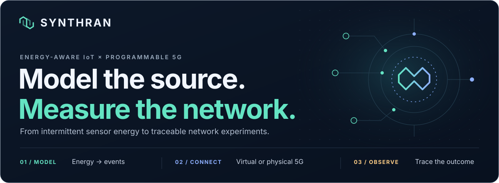
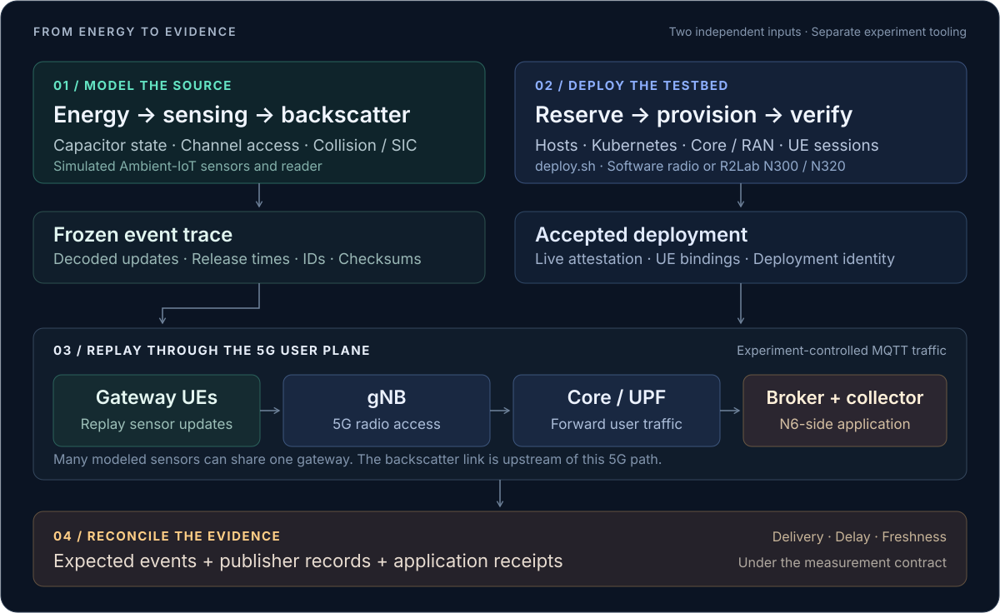

<p align="center">
  <picture>
    <source media="(max-width: 640px)" srcset="docs/assets/readme-hero-mobile.svg">
    
  </picture>
</p>

<p align="center">
  <strong>Energy-aware Ambient IoT · Reproducible workloads · Virtual and physical 5G</strong><br>
  <sub>Research software · Python 3.11+ · Ansible · Kubernetes · MQTT</sub>
</p>

<p align="center">
  <a href="#overview">Overview</a> ·
  <a href="#architecture">Architecture</a> ·
  <a href="#quickstart">Quickstart</a> ·
  <a href="#experiments">Experiments</a> ·
  <a href="#evidence">Evidence</a> ·
  <a href="#repository-map">Code map</a>
</p>

---

## Overview

**A sensor can have something to say before it has the energy to say it.**

Ambient-IoT devices harvest power from radio waves or their environment. Their available energy shapes when they can sense, process data, and communicate. When many devices share an energy source, their updates can arrive in bursts—even if their average traffic rate looks modest.

**SynthRAN brings those energy-driven workloads together with configurable 5G testbeds.** It models the sensors, freezes their decoded updates into reproducible traces, provisions the network, and provides tools to replay and reconcile the resulting traffic. The research goal is to connect **what happens at the sensor** with **what reaches the application**.

| You want to understand… | SynthRAN provides… |
| :--- | :--- |
| How an intermittent energy supply changes communication | A discrete-event model of harvesting, capacitors, sensing, backscatter, collisions, and decoding. |
| Whether the timing of updates changes network behavior | Immutable workloads and matched timing variants with preserved event identities and payloads. |
| How those workloads behave over a 5G user plane | Configurable core/RAN deployment, software UEs, and physical R2Lab modem/radio paths. |
| What actually happened in a run | Model evidence, deployment identity, publisher records, application receipts, and reconciliation. |

> **The key distinction:** the Ambient-IoT sensors and their backscatter link are simulated. Their decoded updates become application traffic carried by gateway UEs over a separately deployed 5G network. Physical radio experiments use R2Lab hardware; software radio paths support virtual experiments.

## Architecture

<p align="center">
  <picture>
    <source media="(max-width: 640px)" srcset="docs/assets/readme-architecture-mobile.svg">
    
  </picture>
</p>

The model runs before replay. **Only successfully decoded sensor updates enter the transport trace.** A modeled sensor is a logical device; a gateway is a UE carrying one or more sensors' updates. Increasing the sensor population therefore does not require one physical modem per sensor.

The architecture is **open loop**: measured network congestion does not feed back into the simulated sensor energy or backscatter behavior. Freezing the source makes it possible to reuse the same workload in controlled transport comparisons.

<details>
<summary><strong>Inside the model: the controls available to an experiment</strong></summary>

| Layer | Available controls |
| :--- | :--- |
| Energy supply | Wireless power transfer, environmental, hybrid, and always-powered modes; recorded CSV inputs or seeded common/independent lognormal sources. |
| Circuit and sensing | Capacitance, series resistance, leakage, voltage thresholds, state currents, sensing intervals, and phases. |
| Radio environment | Sensor/reader placement, sector geometry, propagation, frequency, and receiver thresholds. |
| Access protocol | `broadcast`, `broadcast_sic`, `unicast`, `framed_aloha`, and `adaptive_aloha`. |
| Receiver | Overlapping airtime, SINR-based decoding, and SIC with residual interference. |
| Transport workload | Sensor-to-gateway mapping, payload size, MQTT QoS 0/1, release timing, and publisher queue/inflight limits. |

Model controls describe the simulated source; physical 5G settings belong to the deployment and campaign configuration. See the [runner](synthran/ambient_iot/runner.py), [protocol policies](synthran/ambient_iot/protocols.py), and [scientific configuration loader](synthran/experiment_scenario.py).

</details>

### Two responsibilities, one research workflow

| Responsibility | Entry point / location | What it owns |
| :--- | :--- | :--- |
| **Deploy the testbed** | [`deploy.sh`](deploy.sh), [`deployment/`](deployment/) | Resource booking, host preparation, Kubernetes, core/RAN deployment, UE/session verification, and live deployment attestation. |
| **Run the science** | [`Experiment/`](Experiment/), [`synthran/`](synthran/) scientific modules | Campaign definitions, sensor models, frozen workloads, transport instrumentation, and analysis. |

`./deploy.sh` stops at an accepted testbed. Experiment lifecycle helpers already exist in [`synthran/experiment_runner.py`](synthran/experiment_runner.py); a unified campaign launcher that selects and orchestrates an accepted deployment remains separate integration work. The commands below expose the current model and deployment entry points.

<details>
<summary><strong>A short guide to the vocabulary</strong></summary>

| Term | Meaning here |
| :--- | :--- |
| **Ambient IoT** | Small, energy-constrained devices that harvest power and communicate intermittently. |
| **Backscatter** | Communication by changing how an incoming radio signal is reflected; modeled in SynthRAN. |
| **UE** | User equipment: a software UE or physical modem acting as a gateway for sensor updates. |
| **RAN / gNB** | The radio access network / its 5G base station. |
| **UPF / N6** | The core's User Plane Function / its connection to the application-side data network. |
| **MQTT** | The publish/subscribe messaging protocol used to transport updates to a broker and receiving application. |
| **SIC** | Successive interference cancellation: decode a signal, subtract its estimated contribution, and attempt to recover others. |
| **AoI** | Age of Information: how old the application's latest known sensor update is as time passes. |

</details>

## Quickstart

**Start locally with one model run, or deploy a testbed when you have access to the required resources.** Run the commands from the repository root.

### 1. Get the repository

```bash
git clone https://github.com/RA-Nayreed/SynthRAN.git
cd SynthRAN
```

### 2. Explore the model locally

Use Python 3.11+ with `venv` and `pip`. These commands use a POSIX shell; the model does not require a USRP, a modem, or a testbed account.

```bash
python3 -m venv .venv
source .venv/bin/activate
python -m pip install -e '.[experiment]'

python Experiment/Ex1_Energy_Correlation_and_Burst_Formation/run_experiment.py \
  --condition knee-common \
  --seed 1001 \
  --results-root results/quickstart

python -m synthran.cli workload validate \
  --source results/quickstart/knee-common-seed1001
```

This selects **one 60-second simulated run with 32 modeled sensors**, using the intermediate energy setting and a shared harvesting process from Experiment 1. It creates a checksummed bundle in `results/quickstart/knee-common-seed1001/`.

Start with `ambient_iot/summary.json` for model outcomes, `events.jsonl` for decoded updates, and `source-manifest.json` for lineage. Use a fresh output directory for another run; existing bundles are protected against overwriting.

<details>
<summary><strong>Change timing while keeping the same events</strong></summary>

Create a timing intervention from that native bundle:

```bash
python -m synthran.cli workload transform \
  --source results/quickstart/knee-common-seed1001 \
  --output results/quickstart/permuted \
  --variant gap_permutation \
  --seed 101 \
  --warmup-seconds 10

python -m synthran.cli workload validate \
  --source results/quickstart/permuted
```

The available variants are `native`, `gap_permutation`, and `periodic`. Timing interventions preserve event identity and serialized payloads while changing release timing. The warm-up segment is retained. Altered timing variants are marked ineligible for physical generation-age claims.

To generate a bundle from your own complete scientific configuration:

```bash
python -m synthran.cli model run \
  --config path/to/your-scientific-scenario.yml \
  --output results/my-source
```

The Experiment 1 [runner](Experiment/Ex1_Energy_Correlation_and_Burst_Formation/run_experiment.py) assembles a complete configuration from its [plan](Experiment/Ex1_Energy_Correlation_and_Burst_Formation/experiment-plan.json) and [template](Experiment/Ex1_Energy_Correlation_and_Burst_Formation/scenario-template.yml). The template alone is incomplete: the runner adds the modeled sensor population.

</details>

### 3. Preview or deploy a 5G testbed

The deployment controller expects **Linux, Bash, Python 3.11+ with `venv`/`pip`, OpenSSH, and `flock`**. Live deployment also needs SSH and privilege access to the configured hosts, package/image connectivity, and the relevant testbed reservations. Automatic SOP-node booking uses an authenticated `pos` CLI; physical R2Lab deployment also requires an R2Lab account and SSH identity.

From a controller that can resolve the configured SOP hostnames, first resolve a preset and render its inventory locally:

```bash
./deploy.sh --config scenarios/r2lab-reference-oai-srsran.yml --dry-run
```

The launcher prepares `.venv` and its deployment dependencies when needed, so the first dry run may install packages. It writes the resolved configuration and inventory without booking or provisioning hardware. Inventory generation still resolves host addresses; for an offline preview, supply explicit `deployment.host_vars.<host>.ip` values in a copy of the preset.

With access configured, choose a testbed interactively:

```bash
./deploy.sh
```

Or deploy an edited preset:

```bash
./deploy.sh --config scenarios/r2lab-reference-oai-srsran.yml --no-input
```

| Option | Behavior |
| :--- | :--- |
| `--config <file>` | Use an infrastructure preset. |
| `--interactive` | Open the wizard with the supplied preset as defaults. |
| `--no-input` | Skip the configuration wizard; requires `--config`. Reservation reconciliation can still require input. |
| `--dry-run` | Resolve configuration and inventory locally; skip booking and provisioning. |
| `--no-reservation` | Skip POS/R2Lab booking while retaining normal infrastructure setup. |
| `--verbose` | Show more Ansible task output. |

### Choose a starting topology

| Preset | Core | RAN | Radio path | Selected UEs |
| :--- | :--- | :--- | :--- | :--- |
| [RFSIM, three UEs](scenarios/rfsim-sidecars-3ue.yml) | Open5GS | srsRAN | Software | `uesim01–03` |
| [R2Lab reference](scenarios/r2lab-reference-oai-srsran.yml) | OAI | srsRAN | N320 | `qhat01`, `qhat03` |
| [N300, three QHATs](scenarios/r2lab-n300-qhats-sdr.yml) | Open5GS | srsRAN | N300 | `qhat01–03` |
| [N320, mixed modems](scenarios/r2lab-n320-mixed-ues-dual-sdr.yml) | free5GC | srsRAN | N320 | `qhat20–21`, `qfit07`, `qfit09` |

These are editable configurations, not a certification matrix. A software-radio preset still deploys network infrastructure on the configured hosts. The code includes OAI, Open5GS, and free5GC core integrations; OAI and srsRAN radio integrations; and the UERANSIM software path. UERANSIM does not drive a physical USRP. Current R2Lab radio selection is limited to **N300 and N320**.

See the [scenario catalog](scenarios/README.md) for preset details. Historical `sdr` filenames do not imply that auxiliary SDR measurement hosts are provisioned.

<details>
<summary><strong>Configure placement, UEs, slices, and access</strong></summary>

An infrastructure scenario selects the deployment. This is the bundled physical reference:

```yaml
deployment:
  core: oai
  ran: srsran
  platform: r2lab
  ru: n320
  network_profile: default
  nodes:
    core: sopnode-f2
    ran: sopnode-f3
    broker: sopnode-f2
  host_vars:
    sopnode-f3:
      cpu_low_latency: true
  ues: [qhat01, qhat03]
  ue_slices:
    qhat01: slice1
    qhat03: slice2
  reservation:
    enabled: true
    duration_minutes: 120
    image: ubuntu-jammy
  r2lab_reservation:
    enabled: true
    duration_minutes: 120
```

`nodes.broker` reserves application-side placement for experiment use; deployment itself does not start the MQTT experiment.

| Configuration surface | Purpose |
| :--- | :--- |
| [`ue_catalog.yaml`](deployment/group_vars/all/ue_catalog.yaml) | Canonical UE identities and transport settings; the wizard filters by platform. |
| [`network_profile_*.yaml`](deployment/group_vars/all/network_profile_default.yaml) | Mobile-network identity, data-network names, slices, QoS, and subscriber security policy. |
| `deployment.ue_slices` | Explicit assignment of every selected UE to a slice in the chosen profile. |
| `deployment.host_vars.<host>` | Connection and host settings, including `ansible_host`, `ip`, CPU tuning, and netplan configuration. |
| `deployment.ansible_vars` | Additional deployment options consumed by the retained roles. |
| [`deployment/topology.yml`](deployment/topology.yml) | Versioned core/RAN network endpoints included in deployment identity. |
| `deployment.r2lab_ssh` | R2Lab connection host, username, and identity settings. |

`R2LAB_USERNAME` and `R2LAB_IDENTITY_FILE` can override R2Lab access values. The launcher loads a local `.r2lab_config` before generating inventory; the upstream inventory identity remains `faraday.inria.fr`. Use the account and identity authorized for your reservation.

UE identity and transport live in the catalog; network policy lives in the profile. Scientific sensor definitions belong to experiment configurations. `deploy.sh` removes any legacy `experiment:` block before resolving a testbed.

</details>

## Experiments

The research program follows a concrete thread: **energy dependence → burst formation → 5G transport behavior → gateway mitigation**. Seven experiment families explore that thread and its supporting questions.

| Study | Research question | Repository status |
| :--- | :--- | :--- |
| **[01 · Energy and bursts](Experiment/Ex1_Energy_Correlation_and_Burst_Formation/)** | Does shared harvesting synchronize sensor output and increase burstiness? | Completed model study recorded; reproduction and analysis scripts included. |
| **[02 · Causal 5G transport](Experiment/Ex2_Flagship_Causal_5G_Transport/)** | Does changing only the release timing of matched events change delivery under load? | Frozen pilot plan and preparation/calibration scripts included; full campaign integration and physical qualification remain. |
| **[03 · MAC, SIC, and freshness](Experiment/Ex3_MAC_SIC_and_End_to_End_Freshness/)** | When does decoding more sensor updates improve application freshness? | Study plan. |
| **[04 · Sensor and gateway scaling](Experiment/Ex4_Sensor_Aggregation_and_UE_Scaling/)** | What limits many sensors per gateway and multiple gateway UEs? | Study plan. |
| **[05 · Slice and QoS isolation](Experiment/Ex5_Slice_and_QoS_Isolation/)** | Can verified uplink resource enforcement protect sensor traffic? | Conditional study plan; configured slices alone do not prove isolation. |
| **[06 · RF robustness and coverage](Experiment/Ex6_N320_RF_Robustness_and_Modeled_Coverage/)** | Does the transport finding survive physical radio impairment? | Study plan; modeled sensor coverage and measured 5G RF effects are distinct. |
| **[07 · Gateway freshness mitigation](Experiment/Ex7_Causal_Gateway_Freshness_Mitigation/)** | Can pacing, fairness, and latest-update forwarding improve freshness? | Study plan; proposed policies require implementation. |

### A result that motivates the next experiment

The [recorded Experiment 1 results](Experiment/Ex1_Energy_Correlation_and_Burst_Formation/RESULTS.md) report **210 model runs: seven conditions × 30 seeds**. At the intermediate energy setting, with 32 modeled sensors:

| Recorded model outcome | Independent harvesting | Common harvesting |
| :--- | ---: | ---: |
| Active fraction | 45.4% | 44.5% |
| Decoded updates per second | 12.628 | 11.294 |
| Fano factor, a measure of count burstiness | 0.584 | 13.391 |
| Collision rate | 7.30% | 15.33% |

The similar active fractions conceal very different traffic patterns. The recorded mechanism is **shared energy → synchronized activation → burstier decoded traffic and greater collision exposure**.

These are simulated source results. Experiment 1 did not establish a reader-freshness degradation, and it does not establish a downstream 5G effect. Its raw bundles are stored outside Git under the ignored `results/` directory; the repository contains the summary, frozen campaign record, and reconstruction code.

## Evidence

**A useful experiment explains both delivered updates and silence.** SynthRAN retains evidence at the source, at deployment, and at the receiving application.

| Layer | Useful artifacts | What they explain |
| :--- | :--- | :--- |
| Model | `events.jsonl`, `suppressed.jsonl`, `ambient_iot/summary.json` | Which updates decoded, which sensing opportunities were suppressed, and the model's outcome counts. |
| Energy and radio | Under `ambient_iot/`: `energy-inputs/`, `capacitor/`, `energy-accounting.jsonl`, `bs-rx.jsonl`, `transitions.jsonl` | Harvested inputs, voltage histories, energy accounting, packet outcomes, and controller transitions. |
| Workload identity | `source-manifest.json`, `resolved-scenario.yml` | Checksums, seed, sensor/gateway mapping, implementation/dependency fingerprints, and transformation lineage. |
| Deployment | `deployment-fingerprint.json`, `live-deployment-evidence.json`, `source-revision.txt` | The selected network, runtime bindings, acceptance evidence, and source revision. |
| Transport | `publisher*.jsonl`, `broker.jsonl`, `summary.json` | Publication attempts, application receipts, duplicates, missing events, and calculated measurements. |

Model bundles live in their chosen output directory. Deployment artifacts live in `results/<run-id>/`; transport artifacts belong to the experiment run. A fresh clone does not contain historical raw results.

<details>
<summary><strong>Measurement semantics that matter</strong></summary>

- **Decoding and delivery are separate outcomes.** A sensor update must finish modeled reception before becoming replay traffic. Multiple readers do not produce duplicate transport events for the same source sample.
- **Application receipt is the delivery observation.** An MQTT PUBACK confirms the relevant protocol exchange; it is not the receiving application's callback. `broker.jsonl` records collector callbacks, not a hardware timestamp at broker ingress.
- **Missing events stay visible.** Reconciliation tracks expected events, unmatched/invalid receipts, duplicates, and missing updates. Deadline-failure measurements include expected events that never arrive and require a complete observation window.
- **Delay needs clock evidence.** Cross-host timestamps require an independently established clock-uncertainty bound. The analysis accepts that external bound; it does not synchronize or independently certify host clocks.
- **Freshness includes silence.** AoI describes the age of the latest known update over elapsed time. Native generation timing, valid clocks, and the measurement contract determine which application-age results are eligible.
- **Repeatability has a boundary.** A frozen model source can be reused. A live radio network still varies; pin the deployment and preserve source seeds, session information, and repeated-run evidence.

The model currently uses one pending sample per sensor and one transmission attempt per generated sample. Command reception and SIC use explicit abstractions rather than a complete waveform decoder or calibrated hardware model. See the [measurement implementation](synthran/results/metrics.py), [reconciler](synthran/results/reconcile.py), and [scientific contract](docs/experiment-readiness.md) for the definitions. Some historical command examples in the scientific documents predate the current package layout; use this README's entry points.

</details>

### Deployment acceptance and logs

Deployment becomes active only after provisioning, UE/session checks, runtime provenance, and fresh live attestation are accepted. The active endpoint is recorded in `.synthran/active-deployment.json`, with its deployment fingerprint and private execution context under `.synthran/`.

Terminal output is grouped by **play → role → task → host**. Complete `ansible.log` and `deployment.log` files remain in the run directory alongside `controller.pid` and `controller-exit-code`.

Once the deployment controller starts, it survives a terminal disconnect. **Ctrl+C cancels the controller and its Ansible descendants.** Configuration, reservation, and dependency preparation happen before that background controller starts.

<details>
<summary><strong>When a run stops, start here</strong></summary>

| Symptom | First place to look |
| :--- | :--- |
| Runtime preparation fails | The run's `bootstrap.log` and the dependency pins in `pyproject.toml`. |
| Reservation fails | POS/R2Lab access, existing reservation coverage, and the reservation output. |
| A playbook or UE connection fails | The first failed task in `ansible.log`, with the selected UE, profile, and host settings. |
| Provisioning completes but no active deployment appears | UE/session checks and `live-deployment-evidence.json`; activation requires accepted evidence. |
| The model emits few or no events | Energy inputs, capacitor histories, suppressed opportunities, and decoding outcomes. |
| Receipts are missing or delay is implausible | Publisher/collector records, UE path bindings, observation window, and clock evidence. |

</details>

## Repository map

| Location | Start here when you want to… |
| :--- | :--- |
| [`deploy.sh`](deploy.sh) | Understand the interactive configuration and deployment launch flow. |
| [`deployment/`](deployment/) | Inspect Ansible roles, provisioning, reservations, network profiles, and UE verification. |
| [`scenarios/`](scenarios/) | Select or edit an infrastructure preset. |
| [`synthran/scenario.py`](synthran/scenario.py), [`inventory.py`](synthran/inventory.py) | Follow testbed validation and inventory generation. |
| [`synthran/deployment_state.py`](synthran/deployment_state.py) | Inspect deployment fingerprints, acceptance, and active state. |
| [`synthran/model/`](synthran/model/) | Study the Amber-derived circuit, propagation, controller, backscatter, and receiver primitives. |
| [`synthran/ambient_iot/`](synthran/ambient_iot/) | Follow model configuration, protocol policies, native evidence, and decoded-event bridging. |
| [`synthran/workload/`](synthran/workload/) | Generate, validate, transform, import, or replay frozen workloads. |
| [`synthran/experiment_runner.py`](synthran/experiment_runner.py), [`experiment_runtime/`](synthran/experiment_runtime/) | Inspect experiment lifecycle helpers and broker/publisher Ansible roles. |
| [`synthran/results/`](synthran/results/) | Understand reconciliation and delay, deadline, and freshness calculations. |
| [`Experiment/`](Experiment/) | Read the seven study families, frozen plans, campaign scripts, and recorded findings. |
| [`docs/`](docs/), [`third_party/`](third_party/) | Read scientific contracts and upstream provenance. |

### Extend SynthRAN

Keep deployment changes in the testbed layer, reusable scientific logic in `synthran/`, and campaign-specific plans and scripts in `Experiment/`. Preserve event lineage and clearly label model output, local validation, and live measurements in proposed changes.

For an issue or pull request, include the relevant configuration, source revision, expected behavior, and the evidence needed to reproduce the problem. Share redacted run artifacts rather than private execution credentials.

## Foundations and attribution

SynthRAN builds on substantial upstream work:

- **Amber**, the Ambient-IoT discrete-event simulator by **Mirana Manafova**, is the origin of the native scientific primitives. See the [import record](third_party/amber/SOURCE.json) and [preserved BSD 3-Clause license](third_party/amber/LICENSE).
- **[SOPNode 5G Ansible](https://github.com/sopnode/5g_ansible)**, derived from [yassir63/5g_ansible](https://github.com/yassir63/5g_ansible), provides the foundation for much of the deployment stack. The [provenance record](third_party/sopnode-5g-ansible/SOURCE.json) identifies the pinned revision and selected files kept identical to upstream.

Read [`LICENSE`](LICENSE) together with [`THIRD_PARTY_NOTICES.md`](THIRD_PARTY_NOTICES.md). The notices document unresolved upstream licensing for the derived deployment files.

---

<p align="center">
  <strong>Understand the source. Control the experiment. Follow the evidence.</strong><br>
  <a href="#quickstart">Run your first model</a> ·
  <a href="Experiment/">Explore the research</a> ·
  <a href="https://github.com/RA-Nayreed/SynthRAN/issues">Open an issue</a>
</p>
