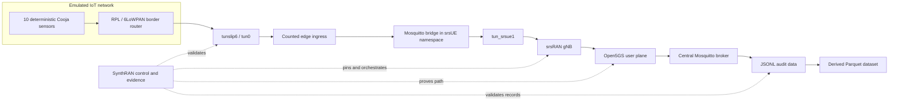

# SynthRAN

**A reproducible experiment platform joining emulated IoT workloads, programmable 5G/Open RAN, and intelligence-ready datasets.**

SynthRAN connects networked IoT simulation to a real 5G user plane and preserves enough evidence to prove what happened. Its first target is a deterministic stream of Contiki-NG/Cooja sensor measurements transported through an srsUE tunnel, an srsRAN gNB, and an Open5GS core into auditable JSONL and reproducible Parquet datasets.

SynthRAN is the integration and experiment-control layer. It reuses upstream systems that already implement 5G deployment, radio access, constrained IoT networking, and MQTT instead of copying them into another fork.

## Why SynthRAN exists

IoT simulators can generate repeatable device behavior. Open 5G stacks can provide programmable radio and core networks. Neither side, by itself, answers the complete experimental question:

> Can a deterministic emulated IoT workload be transported through a provable 5G/Open RAN path and captured as a reproducible dataset suitable for later telemetry and policy synthesis research?

SynthRAN owns the missing experiment contract:

- immutable selection of upstream source and container dependencies;
- validation of one supported network configuration;
- explicit orchestration across IoT, edge, RAN, core, broker, and collector boundaries;
- run-scoped resource ownership and cleanup;
- route, interface, broker, and message-integrity evidence;
- append-only raw records and reproducible analytical datasets.

## Golden path



The initial experiment uses RFSIM rather than physical RF. One srsUE represents an IoT edge gateway serving ten constrained sensors. Sensor-to-edge MQTT uses QoS 0. The edge-to-core Mosquitto bridge runs inside the srsUE pod network namespace, binds to the accepted UE PDU address, and is explicitly routed through `tun_srsue1`.

## What is reused

| System | Responsibility | SynthRAN integration |
|---|---|---|
| `sopnode/5g_ansible` | SLICES node setup and 5G deployment | Complete detached checkout pinned to a commit; wrapped through a narrow adapter |
| Open5GS Kubernetes deployment | 5G core and UPF | Transitive repository pinned to a commit passed into Ansible |
| srsRAN Helm deployment | gNB, srsUE and RFSIM integration | Transitive repository pinned to a commit passed into Ansible |
| Contiki-NG and Cooja | RPL/6LoWPAN firmware and IoT simulation | Complete pinned checkout with an out-of-tree SynthRAN sensor application |
| Eclipse Mosquitto | Edge and central MQTT brokers | Containers pinned by digest with run-scoped configuration |

These repositories are not merged into SynthRAN, copied selectively, or tracked as submodules. Local detached checkouts live under ignored `.deps/` storage. See [dependency reuse and provenance](docs/dependencies.md) and [third-party licenses](THIRD_PARTY.md).

## Current status

The repository foundation and the Open5GS + srsRAN + RFSIM network baseline are implemented. A live SLICES acceptance run has reached `path-proven`, including a healthy run-owned gNB, srsUE and UPF, cell activation, `tun_srsue1`, the expected PDU address and UE/UPF routes.

The integrated IoT-to-5G experiment implementation includes the deterministic ten-sensor Cooja scenario, RPL border-router/tun0 ingress, run-scoped UE-side and central Mosquitto brokers, explicit UE-path routing, central collection, JSONL/Parquet derivation, evidence generation, exact-run cleanup, and base-network reproof. It is not accepted until an operator executes the complete live command and the persisted report returns `IOT-TO-5G PATH PROVEN`.

| Capability | Status |
|---|---|
| Conda environment, immutable dependency metadata and privacy controls | Implemented and tested |
| Pinned upstream dependency synchronization | Implemented and tested |
| Open5GS + srsRAN + RFSIM inventory validation | Implemented and tested |
| Explicit SLICES preparation and evidence-gated network deployment | Implemented and live accepted |
| srsUE/UPF path proof | Implemented and live accepted (`path-proven`) |
| Deterministic ten-sensor Cooja/RPL workload | Implemented; live integrated acceptance pending |
| `tunslip6/tun0` ingress and UE-side Mosquitto bridge | Implemented; live integrated acceptance pending |
| Central MQTT collection and JSONL/Parquet derivation | Implemented; live integrated acceptance pending |
| Integrated IoT-to-5G evidence and cleanup reproof | Implemented; live integrated acceptance pending |
| A1/E2, RIC and generative intelligence | Deliberately deferred |

The supported live controller is the Linux SLICES Webshell, or an SSH session to that documented management host, with the `synthran` Conda environment active. SynthRAN verifies but never changes the SLICES login, selected project, or existing experiment. Resource preparation, network deployment, and experiment execution remain separate operator actions; no experiment command reserves nodes or silently deploys the network.

## Quick start

On Linux, create the complete environment and verify the repository:

```sh
conda env create --file environment.yml
conda activate synthran
python -c "import os; assert os.environ.get('CONDA_DEFAULT_ENV') == 'synthran'"
python -m unittest discover -s tests -v
```

Preview immutable dependency synchronization:

```sh
python -m synthran deps sync --dry-run
```

After synchronizing dependencies, validate a golden-path inventory without contacting SLICES:

```sh
python -m synthran doctor \
  --offline --inventory /path/to/hosts.ini
```

Generate the non-executing network deployment plan:

```sh
python -m synthran network deploy \
  --dry-run --inventory /path/to/hosts.ini
```

On the SLICES controller, verify the active CLI context without changing it:

```sh
python -m synthran slices doctor \
  --slices-project PROJECT \
  --slices-experiment EXPERIMENT
```

The operator performs `slices auth login`, `slices project use PROJECT`, and experiment creation when needed. SynthRAN only performs read-only `show` checks.

Once a network run is `path-proven`, preview the deterministic IoT scenario without changing live state:

```sh
synthran experiment plan \
  --network-run-id NETWORK_RUN_ID \
  --run-id EXPERIMENT_RUN_ID
```

Execute the integrated experiment explicitly:

```sh
synthran experiment run \
  --inventory .synthran/preparations/NETWORK_RUN_ID/hosts.ini \
  --network-run-id NETWORK_RUN_ID \
  --run-id EXPERIMENT_RUN_ID
```

Render the persisted experiment evidence without modifying live state:

```sh
synthran experiment verify --run-id EXPERIMENT_RUN_ID
```

Read the exact safety and acceptance boundary in the [integrated IoT-to-5G experiment guide](docs/experiment.md) and [operator guide](docs/operator-guide.md). The test fixture is not a real deployment inventory.

## Planned experiment output

Every accepted integrated experiment produces a run-scoped evidence bundle containing:

- the deterministic scenario and a manifest referencing the accepted network run;
- exact dependency commits and digest-pinned runtime images through the repository lock;
- append-only sensor messages in JSONL;
- Parquet derived reproducibly from the JSONL record;
- rejected-message metadata and sequence-integrity evidence;
- tunnel and route proof plus broker-delivery evidence;
- Cooja, `tunslip6`, SSH forwarding and controller logs retained locally;
- a final `experiment-evidence.json` report.

The first integrated acceptance contract uses ten sensors publishing every 10 seconds and requires at least three contiguous events from every sensor by default. Missing sensors, duplicate sequences, sequence gaps, malformed events, absent tunnel growth, cleanup failure, or a failed base-network reproof prevents acceptance.

## Repository map

```text
synthran/                 CLI, validation, adapters, collection and orchestration
contracts/                Versioned preparation, network, telemetry and evidence schemas
deploy/                   SynthRAN-owned network overlays and out-of-tree IoT source
tests/                    Offline unit tests and sanitized fixtures
docs/                     Architecture, development, security and operator guides
dependencies.lock.yml     Immutable upstream and direct dependency record
environment.yml           Complete Linux Conda environment, including Ansible
THIRD_PARTY.md            License and provenance record
AGENTS.md                 Durable repository working contract
```

Upstream source remains outside this tree. Generated experiments, dependency checkouts and live evidence remain below ignored local storage.

## Roadmap

| Milestone | Outcome |
|---|---|
| `v0.0.1` | Repository foundation, dependency lock, privacy controls and CI |
| `v0.0.2` | SLICES/`5g_ansible` adapter and live-accepted srsUE/UPF path |
| `v0.0.3` | Integrated deterministic Cooja -> MQTT -> 5G -> JSONL/Parquet acceptance |
| `v0.1.0` | Hardened reproducible experiment lifecycle and release documentation |
| `v0.2+` | Multi-UE/slice experiments, impairments, synthesis and later RIC adapters |

Formal O-RAN A1/E2 control and generative models are not shortcuts around the baseline. They remain deferred until the integrated measured data path is independently accepted.

## Documentation

- [Architecture and responsibility boundaries](docs/architecture.md)
- [Operator guide and safety gates](docs/operator-guide.md)
- [Integrated IoT-to-5G experiment](docs/experiment.md)
- [Development environment and tests](docs/development.md)
- [Dependency reuse and update policy](docs/dependencies.md)
- [Security, privacy and artifact handling](docs/security.md)
- [Third-party provenance](THIRD_PARTY.md)

## License

Original SynthRAN code is licensed under the [Apache License 2.0](LICENSE). External dependencies retain their own licenses and are not relicensed by this repository.
