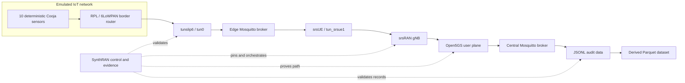

# SynthRAN

**A reproducible experiment platform joining emulated IoT workloads, programmable 5G/Open RAN, and intelligence-ready datasets.**

SynthRAN connects networked IoT simulation to a real 5G user plane and preserves enough evidence to prove what happened. Its first target is a deterministic stream of Contiki-NG/Cooja sensor measurements transported through an srsUE tunnel, an srsRAN gNB, and an Open5GS core into auditable JSONL and reproducible Parquet datasets.

SynthRAN is the integration and experiment-control layer. It reuses the upstream systems that already implement 5G deployment, radio access, constrained IoT networking, and MQTT instead of copying them into another fork.

## Why SynthRAN exists

IoT simulators can generate repeatable device behavior. Open 5G stacks can provide programmable radio and core networks. Neither side, by itself, answers the complete experimental question:

> Can a deterministic emulated IoT workload be transported through a provable 5G/Open RAN path and captured as a reproducible dataset suitable for later telemetry and policy synthesis research?

SynthRAN owns the missing experiment contract:

- immutable selection of upstream source and container dependencies;
- validation of one supported network configuration;
- explicit orchestration across IoT, edge, RAN, core, broker, and collector boundaries;
- run-scoped resource ownership and cleanup;
- route, interface, capture, broker, and message-integrity evidence;
- append-only raw records and reproducible analytical datasets.

## Golden path



The initial experiment uses RFSIM rather than physical RF. One srsUE represents an IoT edge gateway serving ten constrained sensors. Sensor-to-edge MQTT uses QoS 0; the edge-to-core bridge uses QoS 1 and must bind to the UE PDU address.

## What is reused

| System | Responsibility | SynthRAN integration |
|---|---|---|
| `sopnode/5g_ansible` | SLICES node setup and 5G deployment | Complete detached checkout pinned to a commit; wrapped through a narrow adapter |
| Open5GS Kubernetes deployment | 5G core and UPF | Transitive repository pinned to a commit passed into Ansible |
| srsRAN Helm deployment | gNB, srsUE and RFSIM integration | Transitive repository pinned to a commit passed into Ansible |
| Contiki-NG and Cooja | RPL/6LoWPAN firmware and IoT simulation | Complete pinned checkout with a future out-of-tree SynthRAN application |
| Eclipse Mosquitto | Edge and central MQTT brokers | Containers pinned by digest with run-scoped configuration |

These repositories are not merged into SynthRAN, copied selectively, or tracked as submodules. Local detached checkouts live under ignored `.deps/` storage. See [dependency reuse and provenance](docs/dependencies.md) and [third-party licenses](THIRD_PARTY.md).

## Current status

SynthRAN is in early development. The repository foundation is complete, and the golden-path network implementation is awaiting operator acceptance on SLICES.

| Capability | Status |
|---|---|
| Conda environment, immutable dependency metadata and privacy controls | Implemented and tested |
| Pinned upstream dependency synchronization | Implemented and tested |
| Open5GS + srsRAN + RFSIM inventory validation | Implemented and offline-tested |
| Redacted immutable `5g_ansible` deployment plan | Implemented and offline-tested |
| Live reservation, allocation, SSH, Kubernetes, tool and image preflight | Implemented and offline-tested; SLICES acceptance pending |
| Isolated locked-worktree deployment and srsUE/UPF path proof | Implemented and offline-tested; operator execution pending |
| Cooja sensors and MQTT bridge | Planned after network-path acceptance |
| Dataset collection and path-proof report | Planned for later implementation milestones |
| A1/E2, RIC and generative intelligence | Deliberately deferred |

No SynthRAN command reserves or boots a node or runs an experiment. Network deployment is available only as a separate explicit operator command with fresh matching live-preflight evidence.

## Quick start

On Linux, create the complete environment and verify the repository:

```sh
conda env create --file environment.yml
conda activate synthran
python -c "import os; assert os.environ.get('CONDA_DEFAULT_ENV') == 'synthran'"
python -m unittest discover -s tests -v
```

Preview immutable dependency synchronization:

```sh
python -m synthran deps sync --dry-run
```

After synchronizing dependencies, validate a golden-path inventory without contacting SLICES:

```sh
python -m synthran doctor \
  --offline --inventory /path/to/hosts.ini
```

Generate the non-executing deployment plan:

```sh
python -m synthran network deploy \
  --dry-run --inventory /path/to/hosts.ini
```

The test fixture is not a real deployment inventory. Live preflight and deployment must run from a Linux SLICES-capable controller with a real untracked inventory, operator-owned reservation/allocation identifiers, and the prerequisites in the [operator guide](docs/operator-guide.md).

## Planned experiment output

Every experiment will produce a run-scoped evidence bundle containing:

- the validated scenario and a redacted manifest;
- exact dependency commits and container digests;
- append-only sensor messages in JSONL;
- Parquet derived reproducibly from the JSONL record;
- rejected-message and sequence-integrity reports;
- network metrics and route proof;
- a UE-tunnel packet capture retained locally by default;
- broker, Cooja, srsUE, gNB, and deployment logs;
- a final reproducibility and validation report.

The target baseline is 10 sensors publishing every 5 seconds for 600 seconds: 1,200 expected measurements after warm-up. At least 99% must arrive, and every loss, duplicate, malformed event, or sequence gap must be reported.

## Repository map

```text
synthran/                 CLI, validation, adapters and orchestration
contracts/                Versioned readiness, deployment and evidence schemas
deploy/                   SynthRAN-owned narrow Ansible wrapper and overlays
tests/                    Offline unit tests and sanitized fixtures
docs/                     Architecture, development, security and operator guides
dependencies.lock.yml     Immutable upstream and direct dependency record
environment.yml           Complete Linux Conda environment, including Ansible
THIRD_PARTY.md            License and provenance record
AGENTS.md                 Durable repository working contract
```

The current contracts cover golden-path readiness, deployment, and network evidence. Scenario and event contracts arrive with their implementation milestones. Upstream source remains outside this tree.

## Roadmap

| Milestone | Outcome |
|---|---|
| `v0.0.1` | Repository foundation, dependency lock, privacy controls and CI |
| `v0.0.2` | SLICES/`5g_ansible` adapter and verified srsUE tunnel |
| `v0.0.3` | Deterministic Contiki-NG/Cooja MQTT workload |
| `v0.0.4` | Edge-to-central Mosquitto bridge over the UE path |
| `v0.0.5` | JSONL/Parquet collector, integrity validation and path proof |
| `v0.1.0` | Reproducible one-command experiment lifecycle |
| `v0.2+` | Multi-UE/slice experiments, impairments, synthesis and later RIC adapters |

Formal O-RAN A1/E2 control and generative models are not shortcuts around the baseline. They begin only after the measured data path is reproducible and independently provable.

## Documentation

- [Architecture and responsibility boundaries](docs/architecture.md)
- [Operator guide and safety gates](docs/operator-guide.md)
- [Development environment and tests](docs/development.md)
- [Dependency reuse and update policy](docs/dependencies.md)
- [Security, privacy and artifact handling](docs/security.md)
- [Third-party provenance](THIRD_PARTY.md)

## License

Original SynthRAN code is licensed under the [Apache License 2.0](LICENSE). External dependencies retain their own licenses and are not relicensed by this repository.
