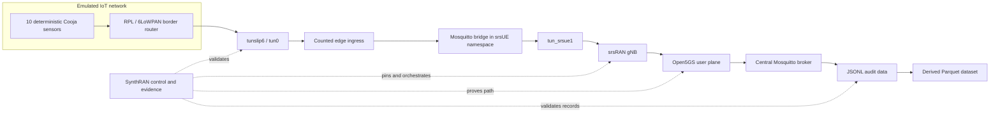

# SynthRAN

**A reproducible experiment platform joining emulated IoT workloads, programmable 5G/Open RAN, and intelligence-ready datasets.**

SynthRAN connects networked IoT simulation to a real 5G user plane and preserves enough evidence to prove what happened. It supports deterministic Contiki-NG/Cooja sensor workloads transported through an srsUE tunnel, an srsRAN gNB, and an Open5GS core into auditable JSONL and reproducible Parquet datasets, alongside controlled research experiments measuring telemetry impact under reproducible background 5G load.

SynthRAN is the integration and experiment-control layer. It reuses upstream systems that already implement 5G deployment, radio access, constrained IoT networking, and MQTT instead of copying them into another fork.

## Why SynthRAN exists

IoT simulators can generate repeatable device behavior. Open 5G stacks can provide programmable radio and core networks. Neither side, by itself, answers the complete experimental question:

> Can a deterministic emulated IoT workload be transported through a provable 5G/Open RAN path and captured as a reproducible dataset suitable for later telemetry and policy synthesis research?

SynthRAN owns the missing experiment contract:

- immutable selection of upstream source and container dependencies;
- validation of one supported network configuration;
- explicit orchestration across IoT, edge, RAN, core, broker, and collector boundaries;
- run-scoped resource ownership and cleanup;
- route, interface, broker, and message-integrity evidence;
- controlled background load generation, RTT probing, and synchronized multi-point network sampling;
- append-only raw records, deterministic analytical datasets, and campaign-level paired analysis.

## Golden path



The initial experiment uses RFSIM rather than physical RF. One srsUE represents an IoT edge gateway serving ten constrained sensors. Sensor-to-edge MQTT uses QoS 0. The edge-to-core Mosquitto bridge runs inside the srsUE pod network namespace, binds to the dynamically discovered UE PDU address, and is explicitly routed through `tun_srsue1`.

In controlled research workflows, the same deterministic workload runs alongside controlled UDP background load over `tun_srsue1` to evaluate 5G transport performance, sequence integrity, RTT latency, and interface throughput across fixed measurement windows.

## What is reused

| System | Responsibility | SynthRAN integration |
|---|---|---|
| `sopnode/5g_ansible` | SLICES node setup and 5G deployment | Complete detached checkout pinned to a commit; wrapped through a narrow adapter |
| Open5GS Kubernetes deployment | 5G core and UPF | Transitive repository pinned to a commit passed into Ansible |
| srsRAN Helm deployment | gNB, srsUE and RFSIM integration | Transitive repository pinned to a commit passed into Ansible |
| Contiki-NG and Cooja | RPL/6LoWPAN firmware and IoT simulation | Complete pinned checkout with an out-of-tree SynthRAN sensor application |
| Eclipse Mosquitto | Edge and central MQTT brokers | Containers pinned by digest with run-scoped configuration |
| iperf3 | Reference capacity calibration and controlled background load | Pinned container and host tools with run-scoped lifecycle |

These repositories are not merged into SynthRAN, copied selectively, or tracked as submodules. Local detached checkouts live under ignored `.deps/` storage. See [dependency reuse and provenance](docs/dependencies.md) and [third-party licenses](THIRD_PARTY.md).

## Current status

The repository foundation, the Open5GS + srsRAN + RFSIM network baseline, the integrated deterministic IoT-to-5G experiment path, and controlled research execution are implemented and live-accepted.

The canonical accepted evidence on SLICES includes:
- **Base 5G network:** `network-acceptance-20260817-04` (`Result: PATH PROVEN`)
- **Integrated IoT-to-5G experiment:** `iot-acceptance-20260817-06` (`Result: IOT-TO-5G PATH PROVEN`)
- **Reference capacity calibration:** `calibration-20260817-02.json` (`67,253,028 bps` / ~67.25 Mbps over `tun_srsue1`)
- **Controlled research baseline:** `pilot-20260817-03-baseline` (`READY FOR CAMPAIGN ANALYSIS`, `IOT-TO-5G PATH PROVEN`, 360/360 events across 10 sensors, 100% delivery, 0 gaps, 0 duplicates, 180 RTT probe samples with 0 timeouts, complete transport path sampling)

| Capability | Status |
|---|---|
| Conda environment, immutable dependency metadata and privacy controls | Implemented and tested |
| Pinned upstream dependency synchronization | Implemented and tested |
| Open5GS + srsRAN + RFSIM inventory validation | Implemented and tested |
| Explicit SLICES preparation and evidence-gated network deployment | Implemented and live accepted |
| srsUE/UPF path proof | Implemented and live accepted (`PATH PROVEN`) |
| Deterministic ten-sensor Cooja/RPL workload | Implemented and live accepted |
| `tunslip6/tun0` ingress and UE-side Mosquitto bridge | Implemented and live accepted |
| Central MQTT collection and JSONL/Parquet derivation | Implemented and live accepted |
| Integrated IoT-to-5G evidence and cleanup reproof | Implemented and live accepted (`IOT-TO-5G PATH PROVEN`) |
| Reference capacity calibration over `tun_srsue1` | Implemented and live accepted |
| Controlled research fixed-window measurement & RTT probing | Implemented and live accepted (`READY FOR CAMPAIGN ANALYSIS`) |
| Deterministic blocked campaign scheduling and offline analysis | Implemented and tested |
| A1/E2, RIC and generative intelligence | Deliberately deferred |

The supported live controller is the Linux SLICES Webshell, or an SSH session to that documented management host, with the `synthran` Conda environment active. SynthRAN verifies but never changes the SLICES login, selected project, or existing experiment. Resource preparation, network deployment, and experiment execution remain separate operator actions; no experiment command reserves nodes or silently deploys the network.

## Quick start

On Linux, create the complete environment and verify the repository:

```sh
conda env create --file environment.yml
conda activate synthran
python -c "import os; assert os.environ.get('CONDA_DEFAULT_ENV') == 'synthran'"
python -m unittest discover -s tests -v
```

### Interactive Terminal Workbench

Launch the prompt-toolkit terminal workbench (no arguments on an interactive TTY):

```sh
synthran
```

On first launch in a new project root, the terminal automatically guides you through verified controller profile and workspace initialization. Within the workbench, use slash-commands to inspect state, reconcile infrastructure, and run experiments:

```text
/status      Render live workspace and experiment status
/inspect     Inspect detailed desired, observed, and resource state
/plan        Generate an immutable reconciliation or experiment plan
/up          Execute the next immediate reconciliation step (requires /mode operate)
/run         Execute the active experiment
/stop        Stop running experiment services
/collect     Collect run artifacts and derived Parquet datasets
/logs        Display recent operation or service logs
/down        Safely tear down deployed resources (requires confirmation)
/mode        Switch between OBSERVE (read-only) and OPERATE (mutating) modes
/quit        Exit the terminal session
```

### Scriptable CLI Workflows

Initialize a workspace explicitly from the CLI:

```sh
python -m synthran init --project PROJECT --profile default
```

Preview immutable dependency synchronization:

```sh
python -m synthran deps sync --dry-run
```

Validate a golden-path inventory without contacting SLICES:

```sh
python -m synthran doctor \
  --offline --inventory /path/to/hosts.ini
```

Generate the non-executing network deployment plan:

```sh
python -m synthran network deploy \
  --dry-run --inventory /path/to/hosts.ini
```

On the SLICES controller, verify the active CLI context without changing it:

```sh
python -m synthran slices doctor \
  --slices-project PROJECT \
  --slices-experiment EXPERIMENT
```

The operator performs `slices auth login`, `slices project use PROJECT`, and experiment creation when needed. SynthRAN only performs read-only `show` checks.

Once a network run is `path-proven`, preview the deterministic IoT scenario without changing live state:

```sh
synthran experiment plan \
  --network-run-id NETWORK_RUN_ID \
  --run-id EXPERIMENT_RUN_ID
```

Execute the integrated experiment explicitly:

```sh
synthran experiment run \
  --inventory .synthran/preparations/NETWORK_RUN_ID/hosts.ini \
  --network-run-id NETWORK_RUN_ID \
  --run-id EXPERIMENT_RUN_ID
```

Render the persisted experiment evidence without modifying live state:

```sh
synthran experiment verify --run-id EXPERIMENT_RUN_ID
```

### Controlled research experiments

Calibrate reference UE-path capacity against a path-proven network:

```sh
python -m synthran experiment research calibrate \
  --inventory .synthran/preparations/NETWORK_RUN_ID/hosts.ini \
  --network-run-id NETWORK_RUN_ID \
  --target CORE_IP \
  --duration-seconds 10 \
  --out .synthran/research/capacity.json
```

Plan and execute a single controlled measurement run:

```sh
python -m synthran experiment research plan \
  --campaign-id pilot-01 \
  --network-run-id NETWORK_RUN_ID \
  --run-id pilot-01-baseline \
  --condition baseline \
  --duration-seconds 180

python -m synthran experiment research run \
  --inventory .synthran/preparations/NETWORK_RUN_ID/hosts.ini \
  --campaign-id pilot-01 \
  --network-run-id NETWORK_RUN_ID \
  --run-id pilot-01-baseline \
  --condition baseline \
  --probe-target CORE_IP \
  --duration-seconds 180
```

Plan, execute, and analyze a randomized blocked campaign:

```sh
python -m synthran experiment research campaign-plan \
  --campaign-id campaign-01 \
  --network-run-id NETWORK_RUN_ID \
  --seeds 424242,424243,424244 \
  --conditions baseline,load50:0.5,load80:0.8 \
  --campaign-seed 12345 \
  --out .synthran/campaigns/campaign-01.json

python -m synthran experiment research campaign-run \
  --campaign .synthran/campaigns/campaign-01.json \
  --inventory .synthran/preparations/NETWORK_RUN_ID/hosts.ini \
  --target CORE_IP \
  --reference-capacity-bps 67253028

python -m synthran experiment research analyze \
  --campaign .synthran/campaigns/campaign-01.json \
  --out .synthran/reports/campaign-01-analysis.json
```

Read the exact safety and acceptance boundary in the [integrated IoT-to-5G experiment guide](docs/experiment.md) and [operator guide](docs/operator-guide.md). The test fixture is not a real deployment inventory.

## Planned experiment output

Every accepted integrated experiment produces a run-scoped evidence bundle containing:

- the deterministic scenario and a manifest referencing the accepted network run;
- exact dependency commits and digest-pinned runtime images through the repository lock;
- append-only sensor messages in JSONL;
- Parquet derived reproducibly from the JSONL record;
- rejected-message metadata and sequence-integrity evidence;
- tunnel and route proof plus broker-delivery evidence;
- Cooja, `tunslip6`, SSH forwarding and controller logs retained locally;
- a final `experiment-evidence.json` report.

Controlled research runs additionally persist:
- `experiment-spec.json`: immutable research run specification;
- `measurement-window.json`: exact UTC start and end bounds of the measurement window;
- `probe.jsonl` and `probe.parquet`: continuous RTT probe samples and timeout flags;
- `network-samples.jsonl` and `network-samples.parquet`: synchronized Ingress, UE `tun_srsue1`, and UPF `ogstun` counter deltas;
- `load.jsonl` and `load.parquet`: background load throughput records (for loaded conditions);
- `research-summary.json`: consolidated research metrics, validity flags, and SHA-256 digests of all source artifacts (`synthran/research-summary/v1alpha1`).

## Repository map

```text
synthran/                 CLI, terminal, app controller, operations, resources, workspace, and research runtime
contracts/                Versioned preparation, network, telemetry, research, and evidence schemas
deploy/                   SynthRAN-owned network overlays and out-of-tree IoT source
tests/                    Offline unit tests and sanitized fixtures
docs/                     Architecture, state management, operations, terminal, and operator guides
dependencies.lock.yml     Immutable upstream and direct dependency record
environment.yml           Complete Linux Conda environment, including Ansible
THIRD_PARTY.md            License and provenance record
AGENTS.md                 Durable repository working contract
```

Upstream source remains outside this tree. Generated experiments, dependency checkouts and live evidence remain below ignored local storage.

## Roadmap

| Version | Outcome |
|---|---|
| `v0.0.1` | Repository foundation, dependency lock, privacy controls and CI |
| `v0.0.2` | SLICES/`5g_ansible` adapter and live-accepted srsUE/UPF path |
| `v0.0.3` | Integrated deterministic Cooja -> MQTT -> 5G -> JSONL/Parquet acceptance |
| `v0.0.4` | Controlled research measurement, capacity calibration, and blocked campaign execution |
| `v0.1.0` | Hardened reproducible experiment lifecycle and release documentation |
| `v0.2+` | Multi-UE/slice experiments, impairments, synthesis and later RIC adapters |

Formal O-RAN A1/E2 control and generative models are not shortcuts around the baseline. They remain deferred until the integrated measured data path is independently accepted.

## Documentation

### Architecture & State Management
- [Architecture and responsibility boundaries](docs/architecture.md)
- [Workspace state, profiles, and durability](docs/workspace-state.md)
- [Experiment desired-state specification](docs/experiment-desired-state.md)
- [Observed testbed state and truth ranking](docs/observed-state.md)
- [First-use controller initialization](docs/initialization.md)

### Interactive Terminal Workbench
- [Terminal shell and interactive UX](docs/terminal-shell.md)
- [Slash-command reference and risk classification](docs/terminal-commands.md)
- [Terminal session management and mode gating](docs/terminal-session.md)

### Operations & Resource Engine
- [Application controller and status projection](docs/application-controller.md)
- [Operation control plane and approval gating](docs/operation-control.md)
- [Structured operation events and stage journaling](docs/operation-events.md)
- [Capability-based resource selection](docs/resource-selection.md)
- [Resource-bound operation planning](docs/resource-operation-binding.md)
- [Composite multi-provider transactions and rollback](docs/resource-transaction.md)

### Experimentation & Operations
- [Operator guide and safety gates](docs/operator-guide.md)
- [Integrated IoT-to-5G experiment and controlled research](docs/experiment.md)
- [Development environment and tests](docs/development.md)
- [Dependency reuse and update policy](docs/dependencies.md)
- [Security, privacy and artifact handling](docs/security.md)
- [Third-party provenance](THIRD_PARTY.md)

## License

Original SynthRAN code is licensed under the [Apache License 2.0](LICENSE). External dependencies retain their own licenses and are not relicensed by this repository.
