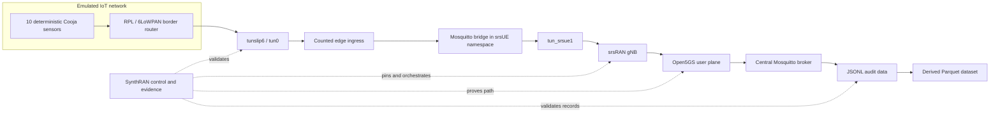

# SynthRAN

**A reproducible experiment platform joining emulated IoT workloads, programmable 5G/Open RAN, and intelligence-ready datasets.**

SynthRAN connects deterministic IoT simulation to a real 5G user plane and preserves enough evidence to prove what happened. It supports Contiki-NG/Cooja sensor workloads transported through an srsUE tunnel, an srsRAN gNB, and an Open5GS core into auditable JSONL and reproducible Parquet datasets, alongside controlled research measurements of telemetry behavior under reproducible 5G load.

SynthRAN is the integration and experiment-control layer. It reuses upstream systems that already implement 5G deployment, radio access, constrained IoT networking, MQTT, and load generation instead of copying them into another fork.

## Why SynthRAN exists

IoT simulators can generate repeatable device behavior. Open 5G stacks can provide programmable radio and core networks. Neither side, by itself, answers the complete experimental question:

> Can a deterministic emulated IoT workload be transported through a provable 5G/Open RAN path and captured as a reproducible dataset suitable for later telemetry and policy synthesis research?

SynthRAN owns the missing experiment contract:

- immutable selection of upstream source and container dependencies;
- validation of one supported network configuration;
- explicit orchestration across IoT, edge, RAN, core, broker, and collector boundaries;
- run-scoped resource ownership and cleanup;
- route, interface, broker, and message-integrity evidence;
- controlled background load generation, RTT probing, and synchronized multi-point network sampling;
- append-only raw records, deterministic analytical datasets, and campaign-level paired analysis.

## Golden path



The accepted experiment uses RFSIM rather than physical RF. One srsUE represents an IoT edge gateway serving ten constrained sensors. Sensor-to-edge MQTT uses QoS 0. The edge-to-core Mosquitto bridge runs inside the srsUE pod network namespace, binds to the dynamically discovered UE PDU address, and is explicitly routed through `tun_srsue1`.

In controlled research workflows, the same deterministic workload runs alongside controlled UDP background load over `tun_srsue1` to evaluate sequence integrity, inter-arrival behavior, RTT, and interface throughput across fixed measurement windows.

## What is reused

| System | Responsibility | SynthRAN integration |
|---|---|---|
| `sopnode/5g_ansible` | SLICES node setup and 5G deployment | Complete detached checkout pinned to a commit; wrapped through a narrow adapter |
| Open5GS Kubernetes deployment | 5G core and UPF | Transitive repository pinned to a commit passed into Ansible |
| srsRAN Helm deployment | gNB, srsUE and RFSIM integration | Transitive repository pinned to a commit passed into Ansible |
| Contiki-NG and Cooja | RPL/6LoWPAN firmware and IoT simulation | Complete pinned checkout with an out-of-tree SynthRAN sensor application |
| Eclipse Mosquitto | Edge and central MQTT brokers | Containers pinned by digest with run-scoped configuration |
| iperf3 | Reference capacity calibration and controlled background load | Pinned container and host tools with run-scoped lifecycle |

These repositories are not merged into SynthRAN, copied selectively, or tracked as submodules. Local detached checkouts live under ignored `.deps/` storage. See [dependency reuse and provenance](docs/dependencies.md) and [third-party licenses](THIRD_PARTY.md).

## Current status

The repository foundation, Open5GS + srsRAN + RFSIM base network, deterministic IoT-to-5G data path, capacity calibration, and one controlled baseline measurement are implemented and live accepted.

Canonical accepted SLICES evidence includes:

- **Base 5G network:** `network-acceptance-20260817-04` (`Result: PATH PROVEN`)
- **Integrated IoT-to-5G experiment:** `iot-acceptance-20260817-06` (`Result: IOT-TO-5G PATH PROVEN`)
- **Reference capacity calibration:** `calibration-20260817-02.json` (`67,253,028 bps`, about 67.25 Mbps over `tun_srsue1`)
- **Controlled research baseline:** `pilot-20260817-03-baseline` (`READY FOR CAMPAIGN ANALYSIS`, 360/360 telemetry events, zero gaps or duplicates, 180 successful RTT samples, complete transport-path sampling)

The historical `pilot-20260817-03-load50` run is **invalid evidence for a loaded-condition result**: the background load was not established and the underlying RFSIM/5G path collapsed. A fresh valid loaded run is still required before drawing scientific conclusions about load50, load80, or load95.

| Capability | Status |
|---|---|
| Conda environment, dependency metadata and privacy controls | Implemented and tested |
| Pinned upstream dependency synchronization | Implemented and tested |
| Open5GS + srsRAN + RFSIM inventory validation | Implemented and tested |
| Explicit SLICES preparation and evidence-gated network deployment | Implemented and live accepted |
| srsUE/UPF path proof | Implemented and live accepted (`PATH PROVEN`) |
| Deterministic ten-sensor Cooja/RPL workload | Implemented and live accepted |
| `tunslip6/tun0` ingress and UE-side Mosquitto bridge | Implemented and live accepted |
| Central MQTT collection and JSONL/Parquet derivation | Implemented and live accepted |
| Integrated IoT-to-5G evidence and cleanup reproof | Implemented and live accepted (`IOT-TO-5G PATH PROVEN`) |
| Reference capacity calibration over `tun_srsue1` | Implemented and live accepted |
| Controlled baseline measurement and RTT/network sampling | Implemented and live accepted |
| Loaded-condition validity gates, blocked campaign scheduling, and offline analysis | Implemented and offline tested; valid loaded campaign evidence still pending |
| Persistent workspace, desired/observed state, reconciliation and operation control | Implemented and offline tested |
| Session-first `prompt_toolkit` terminal | Implemented for state inspection and workflow planning |
| Terminal-triggered provider/domain execution | Not connected yet; plans stop at `Execution: not started` |
| A1/E2, RIC and generative intelligence | Deliberately deferred |

The supported live controller is the Linux SLICES Webshell, or an SSH session to its documented management host, with the `synthran` Conda environment active. SynthRAN verifies but does not perform SLICES login, change the selected project, or create the provider experiment. Resource preparation, base-network deployment, verification, and live experiment execution remain explicit operator actions.

## Interface and safety model

There is one product executable, `synthran`, with two interface paths:

```text
synthran
  -> no arguments: interactive terminal workbench
  -> explicit arguments: existing scriptable CLI
```

The interactive terminal uses the durable workspace, `ApplicationController`, reconciliation/workflow policy, and immutable operation engine. It does **not** invoke the scripted CLI behind the scenes.

For terminal workflow commands, planning and provider execution are intentionally separate:

```text
slash command
-> TerminalSession
-> TerminalCommandRouter
-> ApplicationController
-> reconciliation or workflow policy
-> immutable OperationPlan
-> approval / drift / ownership gates
-> ExecutionPermit
-> provider/domain executor   # not connected for terminal workflows yet
```

A terminal operation plan therefore proves what may be done, but does not by itself reserve, deploy, start, stop, collect, read remote logs, or tear down live provider resources.

## Quick start

On Linux, create the complete environment and verify the repository:

```sh
conda env create --file environment.yml
conda activate synthran
python -c "import os; assert os.environ.get('CONDA_DEFAULT_ENV') == 'synthran'"
python -m unittest discover -s tests -v
```

### Interactive terminal workbench

Launch the workbench with no arguments:

```sh
synthran
```

On first launch in an uninitialized checkout, the terminal performs the verified local initialization flow and can adopt compatible existing `.synthran` research artifacts without moving or deleting them. If the workspace has no active SynthRAN experiment, it can create the durable requested experiment state locally. Provider resources are not mutated by initialization or experiment creation.

The authoritative terminal vocabulary is:

```text
/status
/inspect resources|network
/reserve
/up
/verify
/recover
/down
/run baseline|congestion
/stop
/collect
/logs network|open5gs|ue
/config resources|experiment
/mode observe|operate
/help
/clear
/quit
```

`/status`, `/inspect`, `/config`, `/help`, `/clear`, `/quit`, and mode handling are terminal/application functions. Workflow commands such as `/reserve`, `/up`, `/verify`, `/run`, `/collect`, and `/down` create state-sensitive immutable operation plans or fail closed. They currently do **not** execute the corresponding provider/domain action from the terminal.

See [terminal shell and execution boundary](docs/terminal-shell.md) and [terminal command contract](docs/terminal-commands.md).

### Scriptable live workflows

The existing explicit CLI remains the current operator path for live provider execution. For example:

```sh
python -m synthran deps sync --dry-run
python -m synthran doctor --offline --inventory /path/to/hosts.ini
python -m synthran slices doctor --slices-project PROJECT --slices-experiment EXPERIMENT
python -m synthran network deploy --dry-run --inventory /path/to/hosts.ini
```

The operator establishes SLICES authentication/project/experiment context outside SynthRAN. There is currently **no top-level `synthran init` scripted command**; persistent workspace initialization is performed by the no-argument terminal startup flow.

Once a network run is `path-proven`, preview and execute the deterministic IoT scenario explicitly:

```sh
synthran experiment plan \
  --network-run-id NETWORK_RUN_ID \
  --run-id EXPERIMENT_RUN_ID

synthran experiment run \
  --inventory .synthran/preparations/NETWORK_RUN_ID/hosts.ini \
  --network-run-id NETWORK_RUN_ID \
  --run-id EXPERIMENT_RUN_ID

synthran experiment verify --run-id EXPERIMENT_RUN_ID
```

### Controlled research experiments

Calibrate reference UE-path capacity against a path-proven network:

```sh
python -m synthran experiment research calibrate \
  --inventory .synthran/preparations/NETWORK_RUN_ID/hosts.ini \
  --network-run-id NETWORK_RUN_ID \
  --target CORE_IP \
  --duration-seconds 10 \
  --out .synthran/research/capacity.json
```

Plan and execute a single controlled measurement run:

```sh
python -m synthran experiment research plan \
  --campaign-id pilot-01 \
  --network-run-id NETWORK_RUN_ID \
  --run-id pilot-01-baseline \
  --condition baseline \
  --duration-seconds 180

python -m synthran experiment research run \
  --inventory .synthran/preparations/NETWORK_RUN_ID/hosts.ini \
  --campaign-id pilot-01 \
  --network-run-id NETWORK_RUN_ID \
  --run-id pilot-01-baseline \
  --condition baseline \
  --probe-target CORE_IP \
  --duration-seconds 180
```

Plan and analyze a deterministic blocked campaign with the dedicated research commands. Do not interpret a loaded condition scientifically unless its own validity gates report it ready for campaign analysis.

Read the exact live safety and acceptance boundary in the [integrated experiment guide](docs/experiment.md) and [operator guide](docs/operator-guide.md). Test fixtures are not deployment inventories.

## Planned experiment output

Every accepted integrated experiment produces a run-scoped evidence bundle containing:

- the deterministic scenario and a manifest referencing the accepted network run;
- exact dependency commits and digest-pinned runtime images through the repository lock;
- append-only sensor messages in JSONL;
- Parquet derived reproducibly from the JSONL record;
- rejected-message metadata and sequence-integrity evidence;
- tunnel and route proof plus broker-delivery evidence;
- Cooja, `tunslip6`, SSH forwarding and controller logs retained locally;
- a final `experiment-evidence.json` report.

Controlled research runs additionally persist:

- `experiment-spec.json`: immutable research run specification;
- `measurement-window.json`: exact UTC start and end bounds of the measurement window;
- `probe.jsonl` and `probe.parquet`: RTT samples and timeout flags;
- `network-samples.jsonl` and `network-samples.parquet`: synchronized Ingress, UE `tun_srsue1`, and UPF `ogstun` counter deltas;
- `load.jsonl` and `load.parquet`: background-load throughput records for loaded conditions;
- `research-summary.json`: consolidated research metrics, validity flags, and SHA-256 artifact digests.

## Repository map

```text
synthran/                 CLI, terminal, application, operations, resources, workspace, network and research runtime
contracts/                Versioned preparation, network, telemetry, research, and evidence schemas
deploy/                   SynthRAN-owned network overlays and out-of-tree IoT source
tests/                    Offline unit tests and sanitized fixtures
docs/                     Architecture, state, operations, terminal, experiment and operator guides
dependencies.lock.yml     Immutable upstream and direct dependency record
environment.yml           Complete Linux Conda environment
THIRD_PARTY.md            License and provenance record
AGENTS.md                 Durable repository working contract
```

Upstream source remains outside this tree. Generated experiments, dependency checkouts, authority files, and live evidence remain below ignored local storage.

## Roadmap

The table below is a capability roadmap, not a statement of published package versions. `pyproject.toml` remains the authoritative package version.

| Capability target | Outcome |
|---|---|
| `v0.0.1` | Repository foundation, dependency lock, privacy controls and CI |
| `v0.0.2` | SLICES/`5g_ansible` adapter and live-accepted srsUE/UPF path |
| `v0.0.3` | Integrated deterministic Cooja -> MQTT -> 5G -> JSONL/Parquet acceptance |
| `v0.0.4` | Controlled research measurement, capacity calibration, and campaign machinery |
| `v0.1.0` | Hardened shared lifecycle, concrete terminal/provider execution adapters, release documentation |
| `v0.2+` | Multi-UE/slice experiments, impairments, synthesis and later RIC adapters |

Formal O-RAN A1/E2 control and generative models remain deferred until the measured baseline and controlled loaded experiments are independently accepted.

## Documentation

### Architecture and state
- [Architecture and responsibility boundaries](docs/architecture.md)
- [Workspace state, profiles, and durability](docs/workspace-state.md)
- [Experiment desired-state specification](docs/experiment-desired-state.md)
- [Observed testbed state and truth ranking](docs/observed-state.md)
- [First-use controller initialization](docs/initialization.md)

### Interactive terminal
- [Terminal shell and interactive UX](docs/terminal-shell.md)
- [Slash-command reference and risk classification](docs/terminal-commands.md)
- [Terminal session management and mode gating](docs/terminal-session.md)

### Operations and resources
- [Application controller and status projection](docs/application-controller.md)
- [Operation control plane and approval gating](docs/operation-control.md)
- [Structured operation events and stage journaling](docs/operation-events.md)
- [Capability-based resource selection](docs/resource-selection.md)
- [Resource-bound operation planning](docs/resource-operation-binding.md)
- [Composite multi-provider transactions and rollback](docs/resource-transaction.md)

### Experimentation and repository operation
- [Operator guide and safety gates](docs/operator-guide.md)
- [Integrated IoT-to-5G experiment and controlled research](docs/experiment.md)
- [Development environment and tests](docs/development.md)
- [Dependency reuse and update policy](docs/dependencies.md)
- [Security, privacy and artifact handling](docs/security.md)
- [Third-party provenance](THIRD_PARTY.md)

## License

Original SynthRAN code is licensed under the [Apache License 2.0](LICENSE). External dependencies retain their own licenses and are not relicensed by this repository.
