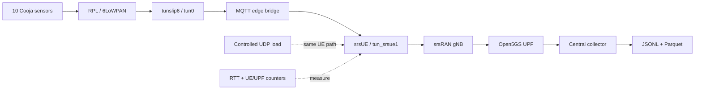

<div align="center">

# SynthRAN

**A reproducible research platform for deterministic IoT traffic over open 5G.**

[](pyproject.toml)
[](docs/architecture.md)
[](docs/experiment.md)
[](docs/results.md)
[](LICENSE)

</div>

## What is SynthRAN?

SynthRAN connects a **repeatable IoT workload** to a **real open 5G user plane**, then records enough evidence to reproduce and analyze what happened.

In one experiment, SynthRAN can:

- generate deterministic sensor traffic in **Contiki-NG/Cooja**;
- carry it through **srsUE → srsRAN → Open5GS**;
- apply controlled background load through the same UE path;
- measure RTT and network counters during a fixed measurement window;
- preserve raw JSONL, deterministic Parquet, validity evidence, and campaign-level analysis.

SynthRAN is the **integration, orchestration, and evidence layer**. It does not reimplement Open5GS, srsRAN, Contiki-NG, Cooja, Mosquitto, or iperf3.

## The experiment path



The currently accepted virtual setup uses **RFSIM**, one srsUE acting as the IoT edge gateway, one SST-1 slice, and ten deterministic sensors. Research load terminates on an external prepared node so the measurement cannot collapse into a same-host Kubernetes path.

## What has been proven?

The first complete blocked research campaign is now live accepted on SLICES.

<table align="center">
  <thead>
    <tr>
      <th align="center">Evidence</th>
      <th align="center">Result</th>
    </tr>
  </thead>
  <tbody>
    <tr><td align="center">Campaign</td><td align="center"><code>campaign-20260819-06</code></td></tr>
    <tr><td align="center">Experimental units</td><td align="center">12 / 12 valid runs</td></tr>
    <tr><td align="center">Design</td><td align="center">3 seeds × baseline / 50% / 80% / 95% load</td></tr>
    <tr><td align="center">Reference UE-path capacity</td><td align="center">66.37 Mbps</td></tr>
    <tr><td align="center">RTT probes</td><td align="center">2,160 attempts, 0 timeouts</td></tr>
    <tr><td align="center">Telemetry sequence integrity</td><td align="center">0 gaps, 0 duplicates</td></tr>
    <tr><td align="center">Loaded UDP transport</td><td align="center">0 receiver packet loss in all 9 loaded runs</td></tr>
    <tr><td align="center">Maximum sustained treatment</td><td align="center">95% reference capacity (~63.05 Mbps)</td></tr>
    <tr><td align="center">Preservation</td><td align="center">raw archive + derived analysis in SLICES object storage</td></tr>
  </tbody>
</table>

The campaign produced an interesting exploratory result: RTT was consistently lower while continuous background traffic was active than during the idle baseline. The effect is reproducible across the three blocks, but **three blocks are not enough for a publication-grade causal claim**. The next scientific step is to isolate whether this is an active-path/scheduling effect rather than a congestion effect.

See **[current results](docs/results.md)** for the protocol, measured values, limitations, checksums, and next experiment.

## Why reproducibility is part of the system

A successful command is not enough evidence for SynthRAN. Accepted runs bind together:

- pinned source commits and runtime images;
- exact experiment specifications and randomized campaign schedules;
- current UE/PDU/route and path proof;
- raw telemetry, RTT, load, and network-counter records;
- run-scoped cleanup and base-network reproof;
- SHA-256 artifact digests and offline analysis.

Failed experiments are retained as diagnostic evidence and are never silently rewritten into successful runs.

## Quick start

SynthRAN's live path is Linux-first and currently operated from a verified SLICES controller.

```bash
conda env create -f environment.yml
conda activate synthran
python -m unittest discover -s tests -v
```

Launch the interactive workbench:

```bash
synthran
```

The terminal is currently **planning-first** for provider-facing workflows. Live preparation, deployment, verification, and research execution still use explicit scripted commands. This boundary is intentional; the terminal does not secretly call the scripted CLI.

For the complete live workflow, use the **[operator guide](docs/operator-guide.md)**.

## Repository guide

<table align="center">
  <thead>
    <tr>
      <th align="center">Area</th>
      <th align="center">Start here</th>
    </tr>
  </thead>
  <tbody>
    <tr><td align="center">What was measured and what it means</td><td align="center"><a href="docs/results.md">docs/results.md</a></td></tr>
    <tr><td align="center">End-to-end experiment and research protocol</td><td align="center"><a href="docs/experiment.md">docs/experiment.md</a></td></tr>
    <tr><td align="center">System architecture and ownership boundaries</td><td align="center"><a href="docs/architecture.md">docs/architecture.md</a></td></tr>
    <tr><td align="center">Live operation</td><td align="center"><a href="docs/operator-guide.md">docs/operator-guide.md</a></td></tr>
    <tr><td align="center">External research measurement peer</td><td align="center"><a href="docs/research-measurement-peer.md">docs/research-measurement-peer.md</a></td></tr>
    <tr><td align="center">Dependency provenance</td><td align="center"><a href="docs/dependencies.md">docs/dependencies.md</a></td></tr>
    <tr><td align="center">Terminal contract</td><td align="center"><a href="docs/terminal-shell.md">docs/terminal-shell.md</a></td></tr>
    <tr><td align="center">Contributor/agent invariants</td><td align="center"><a href="AGENTS.md">AGENTS.md</a></td></tr>
  </tbody>
</table>

```text
synthran/                 application, network, experiment and research runtime
contracts/                versioned evidence and research contracts
deploy/                   SynthRAN-owned overlays and IoT application source
tests/                    offline regression tests and sanitized fixtures
docs/                     architecture, operation, protocol and results
results/                  public derived campaign results (not raw private evidence)
dependencies.lock.yml     immutable upstream dependency record
```

## Current scope

**Live accepted now:** Open5GS + srsRAN + one srsUE + RFSIM, deterministic Cooja/RPL telemetry, external-peer capacity calibration, controlled UDP load, fixed-window RTT/network measurement, blocked campaigns, and offline paired analysis.

**Not claimed yet:** physical-RF acceptance, multiple UEs/slices, formal A1/E2/RIC control, generative models, or automated RAN-policy synthesis. Those are follow-on research directions, not features implied by the current evidence.

## Research status

The infrastructure question is now answered for the accepted virtual path: deterministic IoT traffic can be carried through the open 5G stack under controlled load and captured as reproducible evidence.

The project is now moving from **testbed construction** to **scientific analysis and targeted follow-up experiments**.

---

<div align="center">
<sub>Built for experiments where the evidence matters as much as the result.</sub>
</div>
