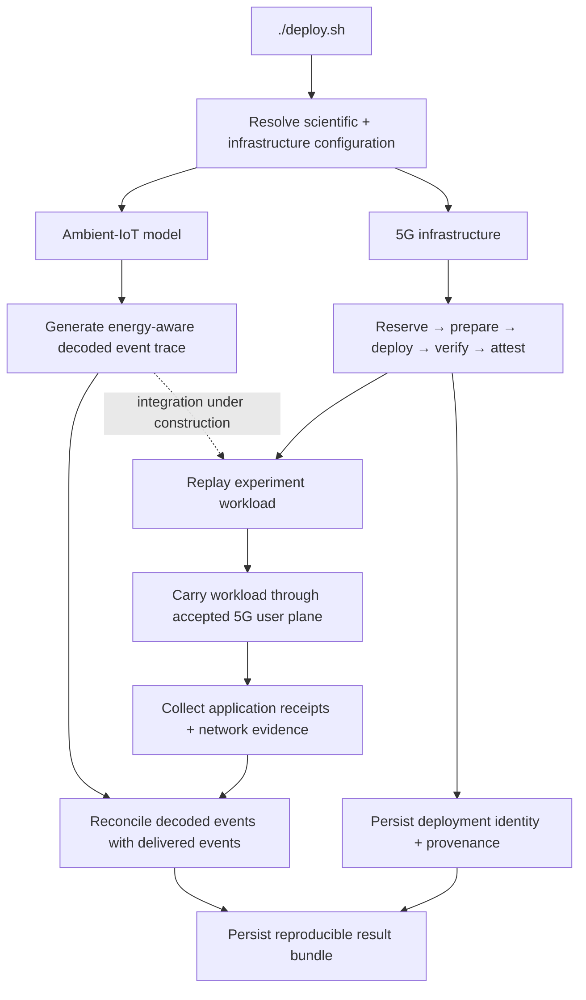

<div align="center">

# SynthRAN

**Ambient-IoT modelling and reproducible 5G experimentation across virtual and physical testbeds.**

<p>
  <a href="https://github.com/RA-Nayreed/SynthRAN/blob/main/pyproject.toml"></a>
  <a href="https://github.com/RA-Nayreed/SynthRAN/blob/main/pyproject.toml"></a>
  <a href="https://github.com/RA-Nayreed/SynthRAN/commits/main"></a>
</p>

</div>

SynthRAN is a research-software platform for studying the path from an **energy-constrained Ambient-IoT device** to an **observable application-level outcome across a programmable 5G network**.

It brings together two equally important parts of the research problem:

1. **Ambient-IoT modelling** — energy harvesting, capacitor state, sensing, backscatter communication, propagation, access protocols, collisions, receiver behaviour and SIC determine which device updates are successfully decoded.
2. **5G testbed orchestration** — virtual or physical network resources are configured, reserved, deployed, verified and recorded so those workloads can be evaluated on a reproducible network path.

The experiment layer that joins these two sides into the final public workflow is still under active construction. The project is converging on a **single supported user entry point**:

```bash
./deploy.sh
```

Internal Python modules and `synthran.cli` are implementation surfaces, not the intended experiment-facing interface.

---

## The idea

Ambient-IoT traffic is not just ordinary periodic sensor traffic. A device may have data to send while lacking enough harvested energy to sense, process or communicate. Energy availability can therefore change **when updates exist, when they are transmitted, which transmissions collide and which packets are eventually decoded**.

SynthRAN models that source-side behaviour and connects it to a reproducible mobile-network environment.

```mermaid
flowchart LR
    ENTRY["./deploy.sh<br/>public entry point"]
    REF["synthran/configs/reference.yml<br/>scientific reference configuration"]

    subgraph AIOT["Ambient-IoT model"]
        ENERGY["Energy input<br/>deterministic trace / harvested power"]
        CAP["Capacitor model<br/>charging · leakage · voltage thresholds"]
        CTRL["Device controller<br/>energy-aware state transitions"]
        SENSE["Sensing opportunities<br/>sample generation / suppression"]
        MAC["Access protocol<br/>broadcast · unicast · framed/adaptive ALOHA"]
        TX["Backscatter transmission<br/>airtime · payload · subcarrier shift"]
        PROP["Propagation + coverage<br/>link budget · RSSI · sensitivity"]
        RX["Reader / receiver<br/>overlap · SINR · collision · SIC"]
        DECODE["Decoded updates<br/>event ID · sequence · generation/decode time"]
        MODEVID["Native model evidence<br/>energy · transitions · TX/RX outcomes"]

        ENERGY --> CAP --> CTRL --> SENSE
        SENSE --> MAC --> TX
        PROP --> TX
        TX --> RX
        PROP --> RX
        RX --> DECODE
        CTRL --> MODEVID
        RX --> MODEVID
    end

    subgraph BRIDGE["Experiment bridge — integration under construction"]
        TRACE["Canonical event trace<br/>decoded events / events.jsonl"]
        REPLAY["Gateway workload replay<br/>energy-gated MQTT telemetry"]
        RECON["Result reconciliation<br/>generated ↔ decoded ↔ delivered"]
    end

    subgraph TESTBED["5G testbed orchestration"]
        RESOLVE["Resolve configuration<br/>core · RAN · radio · nodes · UEs"]
        RESERVE["Reserve resources<br/>SOP nodes / R2Lab when required"]
        PREPARE["Prepare runtime + hosts<br/>inventory · networking · dependencies"]
        CORE["5G core<br/>Open5GS · OAI · free5GC"]
        RAN["RAN<br/>srsRAN · retained OAI components"]
        UE["Gateway UE(s)<br/>software or supported physical modem"]
        RADIO{"Radio path"}
        RFSIM["RFSIM<br/>virtual software path"]
        R2LAB["R2Lab<br/>N300 / N320 physical path"]
        VERIFY["Verify + attest<br/>live network / session acceptance"]

        RESOLVE --> RESERVE --> PREPARE
        PREPARE -. configures .-> CORE
        PREPARE -. configures .-> RAN
        PREPARE -. configures .-> UE
        UE --> RADIO
        RADIO --> RFSIM --> RAN
        RADIO --> R2LAB --> RAN
        RAN --> CORE
        CORE --> VERIFY
        RAN --> VERIFY
        UE --> VERIFY
    end

    subgraph OUTPUT["Application + research evidence"]
        COLLECT["N6-side application / collector<br/>MQTT receipts and transport observations"]
        RESULT["Measurements<br/>delivery · timing · network evidence"]
        PROV["Run provenance<br/>source revision · resolved config · logs"]
        ARTEFACT["Reconciled experiment artefact<br/>inputs + model evidence + network evidence"]

        COLLECT --> RECON
        RECON --> RESULT
        RESULT --> ARTEFACT
        PROV --> ARTEFACT
        MODEVID --> ARTEFACT
    end

    REF --> ENERGY
    ENTRY --> RESOLVE
    DECODE --> TRACE
    TRACE -. planned unified execution .-> REPLAY
    VERIFY -. accepted testbed .-> REPLAY
    REPLAY --> UE
    CORE --> COLLECT
    TRACE --> RECON
    VERIFY --> PROV
```



The model and the 5G deployment remain independently inspectable. That separation is intentional: source behaviour should not be hidden inside network setup, and network behaviour should not be confused with simulated Ambient-IoT radio behaviour.

---

## Ambient-IoT model

The scientific model lives primarily in [`synthran/model/`](synthran/model/) and [`synthran/ambient_iot/`](synthran/ambient_iot/).

It includes the primitives needed to explore energy-aware Ambient-IoT behaviour, including:

- harvested-energy inputs and deterministic energy traces;
- capacitor charging, leakage and voltage thresholds;
- device-controller state transitions;
- sensing and transmission timing;
- backscatter/link behaviour and propagation;
- broadcast, SIC-assisted and contention-based access behaviour;
- packet overlap, collision handling, SINR-based decoding and successive interference cancellation;
- deterministic evidence from successfully decoded updates.

The repository keeps one bundled scientific reference configuration:

```text
synthran/configs/reference.yml
```

That file is a **reference model/workload configuration**, not a list of deployment presets. Additional scientific configurations should be created deliberately for a defined research question rather than accumulated as generic examples.

---

## 5G testbed layer

`deploy.sh` and [`deployment/`](deployment/) own the infrastructure side of SynthRAN.

Bare execution opens the interactive deployment workflow:

```bash
./deploy.sh
```

Inspect the available launcher options with:

```bash
./deploy.sh --help
```

The deployment workflow can select and prepare the mobile core, RAN, radio/platform, SOP-node placement, UE set, network profile, slice assignment and reservation settings. A caller may still provide an explicit deployment configuration with `--config <file>`, but SynthRAN no longer ships a second catalog of duplicated scenario presets.

<div align="center">
<table>
  <thead>
    <tr>
      <th align="center">Capability</th>
      <th align="center">Current repository direction</th>
    </tr>
  </thead>
  <tbody>
    <tr><td align="center">Virtual radio path</td><td align="center">RFSIM-based software deployment</td></tr>
    <tr><td align="center">Physical radio path</td><td align="center">R2Lab with networked N300/N320 USRPs</td></tr>
    <tr><td align="center">Mobile-core integrations</td><td align="center">Open5GS, OAI and free5GC deployment code</td></tr>
    <tr><td align="center">RAN integrations</td><td align="center">srsRAN and retained OAI deployment components</td></tr>
    <tr><td align="center">UE paths</td><td align="center">Software UEs and supported physical modem paths</td></tr>
    <tr><td align="center">Deployment evidence</td><td align="center">Resolved configuration, logs, source revision and live attestation</td></tr>
  </tbody>
</table>
</div>

The presence of an integration in the codebase is not treated as proof that every possible combination has passed a current physical acceptance run. Physical capability claims remain tied to actual run evidence.

---

## One public workflow

The intended end state is deliberately simple to enter while preserving the model/testbed boundary internally:



Today, `deploy.sh` is the supported public entry point for the deployment side. The experiment-selection and execution path is being integrated so users will not need to learn a separate `synthran.cli` workflow to run the science.

Until that boundary is stable, the README intentionally avoids documenting unfinished experiment commands as public API.

---

## Deployment lifecycle

A normal testbed deployment follows a controlled lifecycle rather than a collection of unrelated scripts:

1. **Resolve** — validate the chosen infrastructure settings and render the effective deployment configuration.
2. **Reserve** — reconcile the required SOP-node and, where applicable, R2Lab resources.
3. **Prepare** — create the isolated local runtime and prepare the selected hosts.
4. **Deploy** — configure the chosen core, RAN, radio path, networking and UE environment.
5. **Verify** — verify live network and UE/session behaviour rather than equating process startup with success.
6. **Attest** — record the accepted deployment identity and current evidence.
7. **Persist** — retain logs, source revision, resolved configuration and run evidence.

SynthRAN prevents overlapping deployment controllers with a repository lock and keeps local authority/runtime state beneath `.synthran/`.

---

## Evidence and reproducibility

Deployment runs write evidence beneath:

```text
results/<run-id>/
```

The goal is for a research result to be traceable through a chain such as:

```text
research question
      ↓
source revision + scientific configuration
      ↓
resolved testbed configuration + resources
      ↓
model/workload evidence
      ↓
live network verification
      ↓
transport/application measurements
      ↓
result / figure / publication
```

A process starting successfully is not, by itself, research evidence. SynthRAN distinguishes between **implemented capability**, **accepted behaviour in a particular run**, and **scientifically established results**.

Generated result directories and local credential/authority state should not be committed to Git.

---

## Research layer

[`Experiment/`](Experiment/) contains the evolving studies and research material built around SynthRAN.

The scientific integration is currently **under construction**. This means:

- Ambient-IoT modelling is part of SynthRAN now, not an afterthought to the testbed;
- the testbed can be deployed and attested independently;
- model/workload and experiment-support modules exist internally;
- the final deployment-to-experiment orchestration is not yet advertised as a stable public interface;
- planned studies are not presented here as completed experimental findings.

Focused technical background is available in [`docs/ambient-iot.md`](docs/ambient-iot.md). Research-readiness notes remain in [`docs/experiment-readiness.md`](docs/experiment-readiness.md) while that layer is being consolidated.

---

## Repository map

```text
SynthRAN/
├── deploy.sh            # public entry point; deployment today, unified workflow target
├── deployment/          # testbed provisioning, networking, RAN/core/UE integration
├── synthran/
│   ├── model/           # Ambient-IoT scientific primitives
│   ├── ambient_iot/     # model integration, protocols and evidence
│   └── configs/
│       └── reference.yml# single bundled scientific reference configuration
├── Experiment/          # evolving research studies
├── docs/                # focused technical and research documentation
├── third_party/         # upstream provenance records
├── CITATION.cff         # machine-readable software citation
├── CONTRIBUTING.md      # contribution and validation rules
├── SECURITY.md          # vulnerability-reporting guidance
└── LICENSE              # Apache License 2.0
```

---

## Project status

SynthRAN is pre-1.0 research software under active development. The package is currently versioned as `0.1.0`.

<div align="center">
<table>
  <thead>
    <tr>
      <th align="center">Area</th>
      <th align="center">Status</th>
    </tr>
  </thead>
  <tbody>
    <tr><td align="center">Ambient-IoT scientific model</td><td align="center">Integrated and actively evolving</td></tr>
    <tr><td align="center">Deterministic model/workload evidence</td><td align="center">Implemented in the scientific stack</td></tr>
    <tr><td align="center">Interactive 5G deployment</td><td align="center">Active public workflow through <code>./deploy.sh</code></td></tr>
    <tr><td align="center">RFSIM path</td><td align="center">Implemented in the deployment framework</td></tr>
    <tr><td align="center">R2Lab N300/N320 path</td><td align="center">Implemented; acceptance remains run-specific</td></tr>
    <tr><td align="center">Deployment provenance</td><td align="center">Persisted per deployment run</td></tr>
    <tr><td align="center">Unified model → testbed experiment execution</td><td align="center">Under construction</td></tr>
    <tr><td align="center">Publication-grade experiment campaigns</td><td align="center">Study-specific; no blanket completion claim</td></tr>
  </tbody>
</table>
</div>

---

## Citation

If SynthRAN contributes to published work, cite the exact software version or Git commit used for the experiment. Machine-readable citation metadata is provided in [`CITATION.cff`](CITATION.cff).

A DOI will be added only when an actual archival release exists; the repository does not use placeholder citation identifiers.

---

## Contributing

Contribution and validation expectations are documented in [`CONTRIBUTING.md`](CONTRIBUTING.md). Bug reports and research proposals use structured GitHub issue forms so that implementation defects, testbed evidence and scientific claims are not mixed together.

---

## License

**Copyright © 2026 Rezwan Ahmad Nayreed.**

SynthRAN-original material is licensed under the **Apache License 2.0**. See [`LICENSE`](LICENSE) for the full license text.
