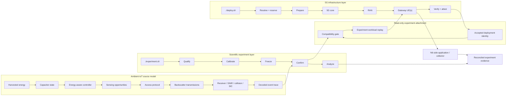

<div align="center">

# SynthRAN

**Ambient-IoT modelling and reproducible 5G experimentation across virtual and physical testbeds.**

<p>
  <a href="https://github.com/RA-Nayreed/SynthRAN/blob/main/pyproject.toml"></a>
  <a href="https://github.com/RA-Nayreed/SynthRAN/blob/main/pyproject.toml"></a>
  <a href="https://github.com/RA-Nayreed/SynthRAN/actions/workflows/ci.yml"></a>
  <a href="https://github.com/RA-Nayreed/SynthRAN/commits/main"></a>
</p>

</div>

SynthRAN is a research-software platform for studying the path from an **energy-constrained Ambient-IoT device** to an **observable application-level outcome across a programmable 5G network**.

The repository deliberately separates two responsibilities that are often mixed together:

- **`deploy.sh` owns infrastructure** — reservation, provisioning, core/RAN/radio deployment, UE preparation, verification, attestation, and accepted deployment state.
- **`experiment.sh` owns science** — experiment selection, qualification, calibration, frozen designs, confirmation campaigns, analysis, and experiment evidence.

That boundary is central to the project: a scientific experiment is not allowed to repair or reconfigure a testbed merely to make a result pass.

---

## What SynthRAN connects



The Ambient-IoT radio side is modeled. A physical N300/N320 path, when used, carries the **5G gateway transport**; it does not turn the upstream modeled Ambient-IoT backscatter link into a physical implementation.

---

## Two public controllers

### Deploy a testbed

```bash
./deploy.sh
```

`deploy.sh` owns infrastructure state. It can resolve a deployment, reconcile required resources, prepare hosts, deploy the selected core/RAN/radio/UE path, verify the live system, and publish an accepted deployment identity.

Inspect the available launcher options with:

```bash
./deploy.sh --help
```

A caller-supplied deployment file may be used with `--config <file>`. SynthRAN intentionally does not maintain a second duplicated catalog of generic deployment scenarios.

### Run a scientific experiment

```bash
./experiment.sh
```

The experiment controller is a separate public entry point. It does not reserve, provision, repair, power-cycle, or rebuild testbed infrastructure.

For Experiment 1, all work is local. Later physical experiments may consume an already accepted compatible deployment through a read-only attachment gate.

Inspect the frontend with:

```bash
./experiment.sh --help
```

A non-interactive Experiment 1 plan can be inspected without executing science:

```bash
./experiment.sh --experiment ex1 --phase all --dry-run --no-input
```

Parallelism is automatic. Independent CPU-bound run units use the maximum safe capacity visible through process affinity and cgroup limits, while scientific dependency barriers remain strict.

---

## Experiment 1 v2

The first study implemented behind `experiment.sh` is:

> **Energy correlation and burst formation**

Its purpose is to test whether shared energy harvesting can synchronize sensor activation and create burstier decoded traffic when marginal energy statistics are matched.

The campaign lifecycle is:

```text
qualification
    ↓
power calibration
    ↓
population calibration
    ↓
freeze confirmation design
    ↓
confirmation
    ↓
analysis
```

The design is versioned in:

```text
Experiments/Ex1_Energy_Correlation_and_Burst_Formation/experiment.yml
```

Important safeguards are built into the workflow:

- the current model must pass retained qualification checks before calibration;
- low/knee/high harvested-power regimes are recalibrated rather than inherited from historical results;
- the contention-transition population is recalibrated at the selected knee;
- calibration seeds and confirmation seeds are disjoint;
- the confirmation treatment matrix is frozen before the 210-run cohort begins;
- confirmation refuses implementation or frozen-source drift;
- existing valid stochastic runs are validated and reused rather than overwritten;
- source seed is retained as the experimental unit for statistical analysis;
- S3 archival state is separate from scientific success, so an object-store outage does not trigger scientific regeneration.

The historical Experiment 1 campaign remains reference evidence only. A new v2 campaign must be run before new scientific conclusions are claimed.

---

## Ambient-IoT model

The scientific model lives primarily in [`synthran/model/`](synthran/model/) and [`synthran/ambient_iot/`](synthran/ambient_iot/).

It includes:

- deterministic and stochastic harvested-energy inputs;
- capacitor charging, leakage, voltage limits, and energy accounting;
- energy-aware controller state transitions;
- periodic sensing opportunities and explicit phase semantics;
- backscatter transmission timing and topology/propagation effects;
- broadcast, unicast, SIC-assisted, and contention-oriented access behavior;
- actual airtime overlap, collision handling, SINR-based decoding, and SIC;
- stable sensor/sample/event lineage;
- canonical decoded `events.jsonl` traces;
- immutable workload bundles with implementation/dependency fingerprints.

The repository keeps one bundled low-level scientific reference configuration:

```text
synthran/configs/reference.yml
```

Study-specific designs belong under `Experiments/` rather than becoming a growing set of generic presets.

---

## 5G testbed layer

[`deployment/`](deployment/) and `deploy.sh` own infrastructure orchestration.

<div align="center">
<table>
  <thead>
    <tr>
      <th align="center">Capability</th>
      <th align="center">Repository support</th>
    </tr>
  </thead>
  <tbody>
    <tr><td align="center">Virtual radio path</td><td align="center">RFSIM-based software deployment</td></tr>
    <tr><td align="center">Physical radio path</td><td align="center">R2Lab with supported networked N300/N320 paths</td></tr>
    <tr><td align="center">5G core integrations</td><td align="center">Open5GS, OAI, free5GC</td></tr>
    <tr><td align="center">RAN integrations</td><td align="center">srsRAN, OAI, UERANSIM where supported by the selected platform</td></tr>
    <tr><td align="center">UE paths</td><td align="center">Software UEs and supported physical modem paths</td></tr>
    <tr><td align="center">Deployment evidence</td><td align="center">Resolved identity, logs, live evidence, source revision, accepted endpoint</td></tr>
  </tbody>
</table>
</div>

The existence of code for a combination is not treated as proof that the combination has passed a current physical acceptance run. Physical capability claims remain tied to actual run evidence.

---

## Read-only accepted-testbed attachment

Physical experiments do not inherit authority to mutate infrastructure.

The attachment layer validates:

- active endpoint and identity integrity;
- accepted deployment hash;
- saved acceptance evidence;
- core, RAN, platform, radio-unit and network-profile compatibility;
- required node roles;
- exact or minimum UE requirements;
- selected slice requirements;
- the private execution context needed to invoke already-deployed infrastructure.

The resulting experiment run records an `accepted-testbed.json` snapshot and pins subsequent workload phases to the same deployment hash. If the active deployment changes after experiment preparation, the experiment refuses to continue against the new infrastructure.

This attachment proves compatibility with a **previously accepted** deployment. It does not prove current RF quality, UE attachment, PDU-session state, or user-plane liveness; those require fresh experiment-time evidence.

---

## Evidence and reproducibility

Deployment evidence is written beneath:

```text
results/<deployment-run-id>/
```

Scientific campaign evidence is written beneath:

```text
results/experiments/<experiment-id>/<campaign-id>/
```

A research result should be traceable through a chain such as:

```text
research question
      ↓
source revision + versioned scientific design
      ↓
qualification + calibrated operating point
      ↓
frozen confirmation contract
      ↓
model/workload evidence
      ↓
accepted deployment identity (when physical)
      ↓
experiment-time transport/application evidence
      ↓
analysis + uncertainty
      ↓
archived immutable evidence
```

For Experiment 1, scientifically valid run evidence is archived to the configured SLICES S3 path after local validation. Each archived unit carries SHA-256 metadata and a completion marker written only after remote verification. Credentials remain external to the repository and are not included in scientific provenance.

A process starting successfully is not, by itself, research evidence. SynthRAN distinguishes between **implemented capability**, **accepted behavior in a specific run**, and **scientifically established results**.

---

## Repository map

```text
SynthRAN/
├── deploy.sh                  # public infrastructure controller
├── experiment.sh              # public scientific experiment controller
├── deployment/                # testbed provisioning, networking, core/RAN/UE integration
├── Experiments/               # versioned study designs and study-specific implementations
│   ├── Ex1_Energy_Correlation_and_Burst_Formation/
│   ├── Ex2_Flagship_Causal_5G_Transport/
│   └── ...
├── synthran/
│   ├── model/                 # Ambient-IoT scientific primitives
│   ├── ambient_iot/           # protocols, model integration, evidence
│   ├── workload/              # immutable workload bundles and replay logic
│   ├── experiment_runtime/    # accepted-testbed runtime mechanics
│   ├── testbed_attachment.py  # read-only accepted-deployment compatibility gate
│   ├── archive.py             # immutable S3 experiment evidence archival
│   └── configs/
│       └── reference.yml      # low-level scientific reference configuration
├── docs/                      # focused technical/research documentation
├── third_party/               # upstream provenance records
├── CITATION.cff               # machine-readable software citation
├── CONTRIBUTING.md            # contribution and validation rules
├── SECURITY.md                # vulnerability-reporting guidance
└── LICENSE                    # Apache License 2.0 for SynthRAN-original material
```

---

## Validation philosophy

CI checks syntax, package metadata, model qualification, calibration-selection contracts, freeze/confirmation matrix construction, analysis metric contracts, immutable archival behavior, and accepted-testbed attachment behavior.

CI deliberately does **not** pretend to replace:

- a real 210-run stochastic confirmation campaign;
- authorized physical N320 acceptance;
- live RF measurements;
- current UE/PDU-session/user-plane verification;
- scientific interpretation of generated results.

Those remain runtime evidence.

---

## Research layer

[`Experiments/`](Experiments/) contains the evolving study designs and study-specific implementations.

The current architecture supports the first publication-oriented Experiment 1 v2 lifecycle. Experiment 2 retains historical/pilot material while its physical campaign is migrated to the standalone experiment controller. Later experiment families remain plans until their implementation and acceptance gates are complete.

Focused background is available in [`docs/ambient-iot.md`](docs/ambient-iot.md). The broader execution and claim boundary is documented in [`docs/experiment-readiness.md`](docs/experiment-readiness.md).

---

## Project status

SynthRAN is pre-1.0 research software under active development. The package is currently versioned as `0.1.0`.

<div align="center">
<table>
  <thead>
    <tr>
      <th align="center">Area</th>
      <th align="center">Status</th>
    </tr>
  </thead>
  <tbody>
    <tr><td align="center">Ambient-IoT scientific model</td><td align="center">Implemented and qualified by retained contract checks</td></tr>
    <tr><td align="center">Immutable model/workload evidence</td><td align="center">Implemented</td></tr>
    <tr><td align="center">Interactive 5G deployment</td><td align="center">Public through <code>./deploy.sh</code></td></tr>
    <tr><td align="center">Scientific experiment frontend</td><td align="center">Public through <code>./experiment.sh</code></td></tr>
    <tr><td align="center">Experiment 1 v2 implementation</td><td align="center">Qualification → calibration → freeze → confirmation → analysis implemented; real v2 campaign still runtime work</td></tr>
    <tr><td align="center">Experiment evidence archival</td><td align="center">Immutable S3 lifecycle implemented for Experiment 1</td></tr>
    <tr><td align="center">Accepted-testbed attachment</td><td align="center">Read-only compatibility gate implemented for later physical experiments</td></tr>
    <tr><td align="center">Physical scientific campaigns</td><td align="center">Run-specific; no blanket completion claim</td></tr>
  </tbody>
</table>
</div>

---

## Citation

If SynthRAN contributes to published work, cite the exact software version or Git commit used for the experiment. Machine-readable citation metadata is provided in [`CITATION.cff`](CITATION.cff).

A DOI will be added only when an actual archival release exists; the repository does not use placeholder citation identifiers.

---

## Contributing

Contribution and validation expectations are documented in [`CONTRIBUTING.md`](CONTRIBUTING.md). Bug reports and research proposals use structured GitHub issue forms so implementation defects, testbed evidence, and scientific claims are not mixed together.

---

## License

**Copyright © 2026 Rezwan Ahmad Nayreed.**

SynthRAN-original material is licensed under the **Apache License 2.0**. See [`LICENSE`](LICENSE) for the full license text. Upstream-derived components retain their own provenance and licensing records under [`third_party/`](third_party/).
