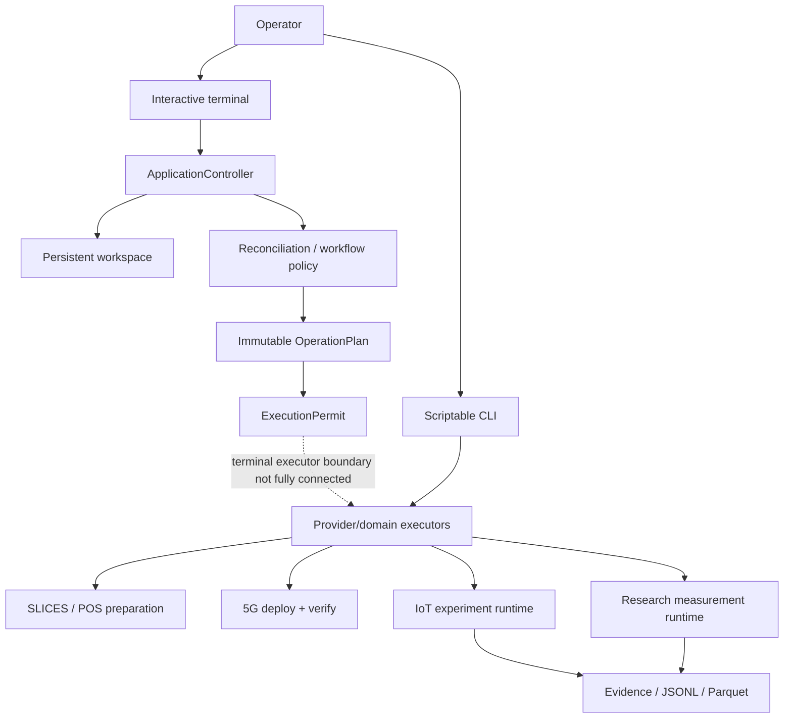
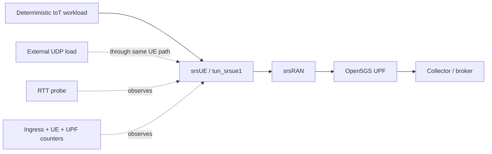

# SynthRAN architecture

SynthRAN is the **experiment-control and evidence layer** above existing IoT, 5G, messaging, and load-generation systems. It composes those systems; it does not fork or reimplement them.

Current live evidence is intentionally kept out of this architecture document. See [`results.md`](results.md) for accepted runs and measured results.

## System boundary



The interactive and scripted interfaces share domain models but are **not yet the same execution pipeline**. The terminal uses the persistent application/operation control plane. The explicit CLI still invokes established live executors directly.

The architectural direction is convergence below the interface boundary. The terminal must not secretly shell out to the scripted CLI to make a planned action look executed.

## Product entrypoint

There is one product executable:

```text
synthran
```

```text
no arguments       -> prompt_toolkit interactive workbench
explicit arguments -> scriptable CLI parser
```

The terminal registry is explicit; there is no natural-language fallback for lifecycle mutation.

## Persistent workspace

Long-lived intent and short-lived provider truth are separated:

```text
~/.config/synthran/profiles/<name>.toml
.synthran/workspace.toml
.synthran/registry.sqlite3
.synthran/active.json
.synthran/experiments/<experiment-id>/desired.json
.synthran/experiments/<experiment-id>/observed.json
.synthran/operations/<operation-id>/...
.synthran/sessions/events.jsonl
```

Historical accepted `.synthran` run/evidence directories may coexist with this newer workspace and must never be moved or rewritten during adoption.

### Desired versus observed state

`ExperimentDesiredState` contains requested intent and stable constraints. Provider-assigned or runtime-discovered values belong in `ObservedState`.

Examples of observed-only facts:

- reservation/allocation IDs;
- provider-assigned nodes;
- pod names;
- live PDU addresses;
- lease/runtime state.

Truth ranking is:

```text
provider
> direct observation
> persisted evidence
> manifest
> cache
```

Historical evidence proves a past event. It does not become current provider mutation authority after its freshness boundary expires.

## Reconciliation and operations

`plan_reconciliation()` is pure and returns only the next safe unresolved network boundary. A representative progression is:

```text
inspect controller/project/provider experiment
-> inspect reservation
-> reserve if absent
-> inspect allocation
-> allocate if absent
-> inspect preparation
-> prepare if absent
-> inspect network runtime
-> up if required components are absent
-> verify path if network is ready but not path-proven
```

Experiment, collection, log, and teardown workflows are separate application policies rather than fake reconciliation steps.

Every controlled operation is represented by an immutable plan bound to current state and exact targets. Authorization recomputes policy and state before issuing an `ExecutionPermit`.

Risk classes are:

```text
R0  local/read-only
R1  live/read-only
R2  controlled mutation
R3  destructive mutation
```

Only one mutating operation may hold the workspace mutation claim. Failed/interrupted mutation retains the claim unless clean rollback is proven.

Progress is represented by validated structured events, not by parsing terminal text or raw provider stdout.

## Resource ownership

Resource selection is deterministic and capability-based. Generic rollback authority comes only from exact resource IDs proven to have been created by the current operation.

Unknown, stale, foreign, or ambiguous ownership fails closed.

This rule applies from provider resources down to run-owned processes and temporary experiment objects. Broad cleanup is intentionally forbidden.

## Dependency composition

SynthRAN reuses complete pinned upstream checkouts:

| System | Role |
|---|---|
| `sopnode/5g_ansible` | SLICES node setup and reviewed 5G deployment path |
| Open5GS | 5G core / UPF |
| srsRAN | gNB, srsUE, RFSIM |
| Contiki-NG + Cooja | deterministic constrained-IoT emulation |
| Eclipse Mosquitto | edge and central MQTT transport |
| iperf3 | external capacity calibration and controlled load |

Dependency trees live under ignored `.deps/` storage. SynthRAN-owned overlays and the IoT application remain in this repository. Runtime images and direct dependencies are pinned through repository-controlled provenance.

## Accepted virtual golden path

```text
10 deterministic Contiki-NG/Cooja sensors
-> RPL/6LoWPAN border router
-> Cooja Serial Socket
-> loopback-only reverse SSH tunnel
-> remote tunslip6/tun0
-> counted TCP ingress
-> Mosquitto bridge inside srsUE network namespace
-> tun_srsue1
-> srsRAN gNB
-> Open5GS UPF
-> run-owned central Mosquitto
-> canonical JSONL
-> deterministic Parquet
```

These are real integration boundaries, not decorative detail: the Cooja Serial Socket crosses the simulator boundary, the reverse SSH tunnel exposes that loopback-only socket safely to the remote experiment node, `tunslip6` creates the IPv6 edge interface, counted TCP ingress records the adapter boundary, and the Mosquitto bridge runs in the srsUE network namespace where the live PDU and `tun_srsue1` exist.

The PDU is rediscovered after RFSIM reconciliation and is not treated as static configuration. Acceptance includes route/interface/broker/message evidence plus exact cleanup and base-network reproof.

## Controlled research architecture

Controlled research wraps the deterministic workload in a fixed measurement window:



The background-load server is on the external prepared RAN node, never on the core host. This prevents same-host Kubernetes/hairpin behavior from masquerading as external user-plane transport.

A research run persists:

- immutable experiment specification;
- exact measurement-window bounds;
- telemetry records;
- RTT attempts/timeouts;
- network counters;
- controlled load records when enabled;
- path/readiness/cleanup evidence;
- a consolidated validity-aware summary and artifact hashes.

### Instrument timing is evidence

Configured cadence and achieved cadence are separate concepts.

Network counter records include sample duration and schedule lag. Future runs fail closed when the sampler cannot materially keep up with the requested cadence. The independent ingress/UE/UPF reads are collected concurrently to minimize skew and remote-query overhead.

This hardening follows the campaign-06 audit, where a requested 1-second counter interval achieved approximately 3-second spacing. That historical limitation is documented in `results.md`; it is not hidden or retroactively rewritten.

### Telemetry integrity is sequence-based

A fixed observation window can contain one fewer periodic message simply because its edge falls between sensor transmissions. Therefore nominal expected-count coverage is not automatically packet loss.

Observed sequence gaps and duplicates are the direct integrity evidence. Scientific loss claims must use those records while keeping independent path/load/instrumentation validity separate.

## Data boundary

Canonical JSONL is the append-only audit source. Deterministic Parquet is an analysis derivative, not a second source of truth.

Research preservation separates:

- raw immutable experiment bundles in durable research/object storage;
- small sanitized derivatives, summaries, and figures suitable for Git.

Artifact digests bind persisted evidence to the summaries that analyze it.

## Privacy boundary

SynthRAN is designed to prove the accepted path without requiring broad packet capture. Route proof, interface counters, broker receipt, run-scoped records, and UPF evidence form the default lower-risk proof surface.

Private keys, provider tokens, S3 secrets, kubeconfigs, authority files, dependency trees, generated run directories, and unsanitized secret-bearing evidence must remain outside Git.

## Current boundary of claims

The live-accepted virtual system currently covers Open5GS + srsRAN + one srsUE + RFSIM, deterministic ten-sensor IoT traffic, external-peer calibration, controlled UDP load, fixed-window instrumentation, randomized blocked campaigns, and offline paired analysis.

Physical RF, multi-UE/slice experiments, RIC/A1/E2 control, generative models, and automated policy synthesis remain future research scope until explicit accepted evidence establishes them.
